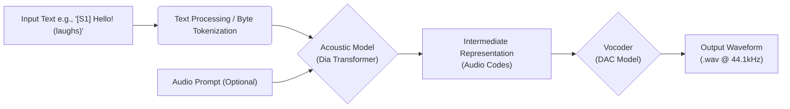
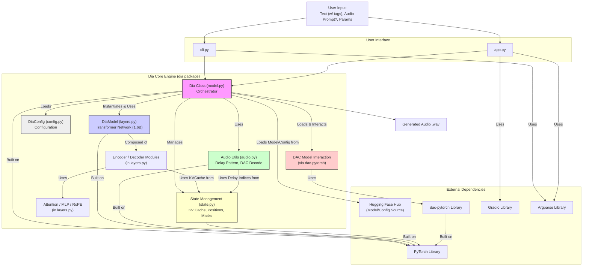
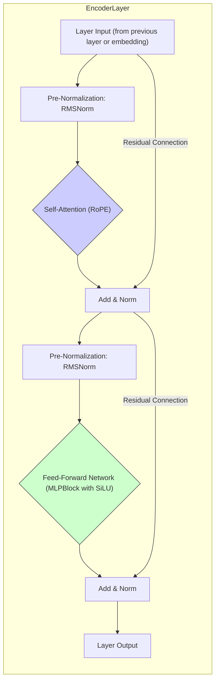
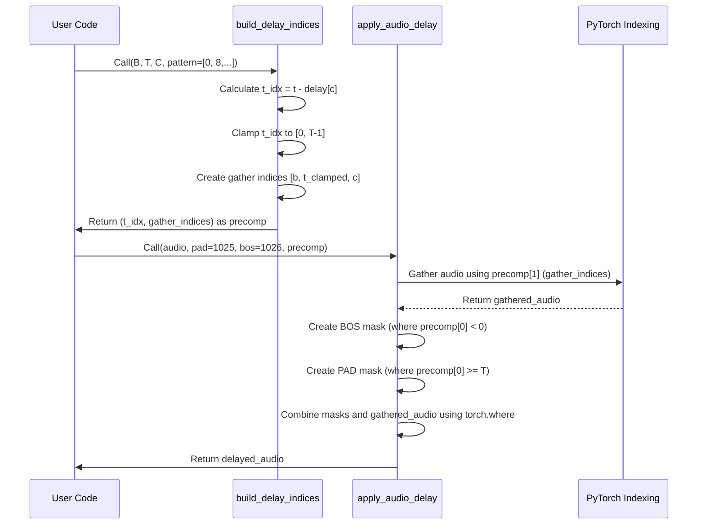
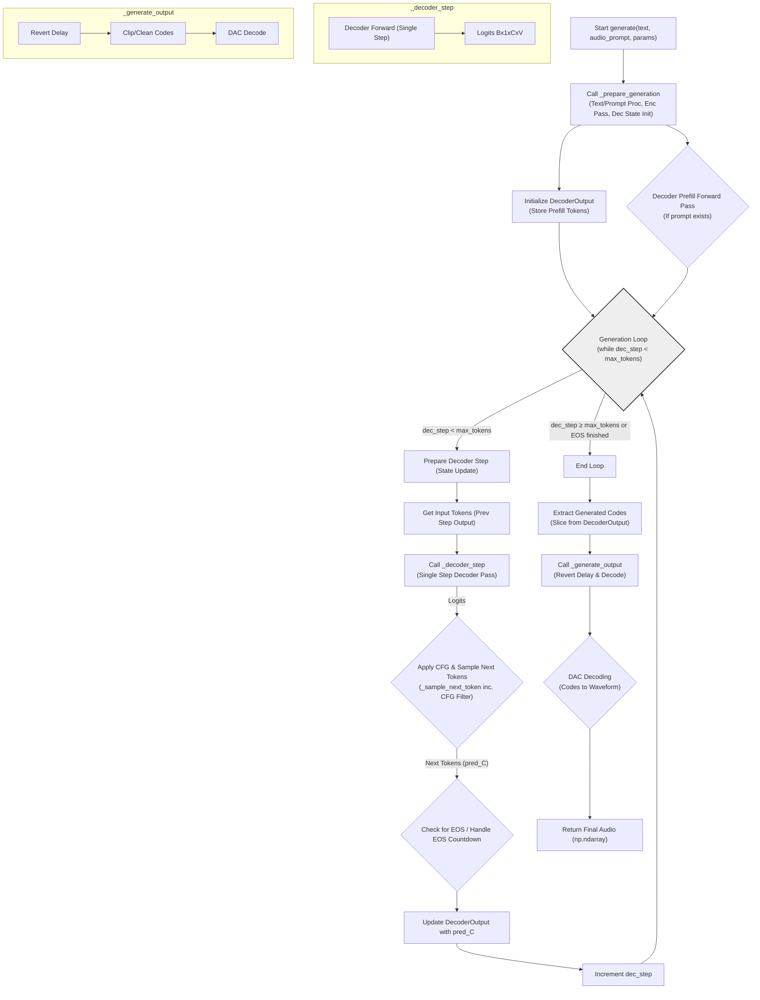
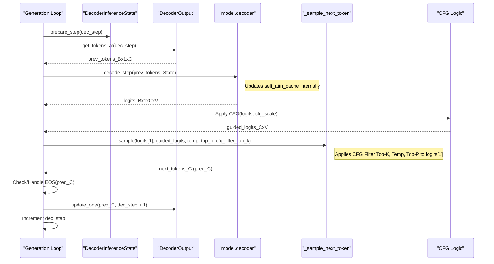

# Dia Explained

# Dia Explained: A Deep Dive into the 1.6B Text-to-Dialogue TTS Model

*   **Introduction**
    *   What is Dia TTS?
    *   Core Features (Dialogue, Voice Cloning, Non-Verbal Sounds)
    *   Target Audience
    *   Prerequisites (Assumed and Covered)
    *   Book Structure
*   **Chapter 1: Getting Started**
    *   Installation
    *   Running the Command-Line Interface (`cli.py`)
    *   Running the Gradio Web Interface (`app.py`)
    *   Basic Input and Output
*   **Chapter 2: Fundamental Concepts**
    *   The Text-to-Speech Pipeline
    *   Transformers for Speech: Encoder-Decoder Architecture
    *   The Role of Audio Codecs (DAC)
    *   Dialogue Synthesis with Speaker Tags (`[S1]`, `[S2]`)
    *   Generating Non-Verbal Sounds (`(laughs)`, etc.)
    *   Voice Cloning via Audio Prompts
    *   Classifier-Free Guidance (CFG) Explained
    *   Audio Token Generation and Sampling (Temperature, Top-P, CFG Filter Top-K)
    *   Introduction to the Delay Pattern Mechanism (Relation to Parakeet/MusicGen)
*   **Chapter 3: System Architecture Overview**
    *   Codebase Structure (`dia/`, `app.py`, `cli.py`)
    *   High-Level Component Interaction (Influences from Parakeet)
    *   Diagram: System Block Diagram
    *   The Central `Dia` Class (`dia/model.py`)
*   **Chapter 4: Configuration Deep Dive (`dia/config.py`)**
    *   Using Pydantic for Configuration
    *   `DataConfig`: Text/Audio Lengths, Channels, Padding/Special Tokens, Delay Pattern
    *   `EncoderConfig` & `DecoderConfig`: Layer Dimensions, Heads (1.6B Parameter Context)
    *   `ModelConfig`: Vocab Sizes, Dropout, RoPE Timescales
    *   `DiaConfig`: The Master Configuration
    *   Loading and Saving Configurations
*   **Chapter 5: The Transformer Encoder (`dia/layers.py`)**
    *   Purpose of the Encoder (Text/Byte Representation)
    *   Text Embedding (`nn.Embedding`) and Handling Non-Verbal Tags
    *   `EncoderLayer` Breakdown
        *   Normalization (`RMSNorm`)
        *   Self-Attention (`Attention` Module with RoPE)
        *   Feed-Forward Network (`MlpBlock`)
    *   The `Encoder` Module Structure
    *   Diagram: `EncoderLayer` Architecture
*   **Chapter 6: The Transformer Decoder (`dia/layers.py`)**
    *   Purpose of the Decoder (Generating Audio Tokens)
    *   Multi-Channel Embeddings
    *   `DecoderLayer` Breakdown
        *   Normalization (`RMSNorm`)
        *   Masked Self-Attention (`Attention` with GQA, RoPE & Caching)
        *   Cross-Attention (`Attention` Module Querying Encoder with RoPE & Precomputed Cache)
        *   Feed-Forward Network (`MlpBlock`)
    *   The `Decoder` Module Structure
    *   Output Logits Projection (`DenseGeneral`)
    *   Diagram: `DecoderLayer` Architecture
*   **Chapter 7: Handling Audio Tokens: The Delay Pattern (`dia/audio.py`)**
    *   Rationale Behind the Delay Pattern (Context from Parakeet/MusicGen)
    *   Applying the Delay (`build_delay_indices`, `apply_audio_delay`)
    *   Reverting the Delay (`build_revert_indices`, `revert_audio_delay`)
    *   Interaction with BOS/PAD Tokens
    *   Diagram: Illustration of Delay Application/Reversion
*   **Chapter 8: The Inference Pipeline (`dia/model.py`, `dia/state.py`)**
    *   The `generate()` Method Flow
    *   Diagram: `generate()` Flowchart
    *   Input Preparation
        *   Text Processing (`_prepare_text_input` including non-verbals)
        *   Audio Prompt Processing (`load_audio`, `_prepare_audio_prompt`)
    *   Encoder Pass and State (`EncoderInferenceState`)
    *   Decoder Setup
        *   Precomputing Cross-Attention Cache (`precompute_cross_attn_cache`)
        *   Initializing Decoder State (`DecoderInferenceState`, `KVCache`)
        *   Handling Prefill Data (`DecoderOutput`)
        *   Decoder Prefill Forward Pass
    *   Autoregressive Decoding Loop
        *   The `_decoder_step` Function
        *   KV Caching (`KVCache.update`)
        *   Applying CFG
        *   Sampling (`_sample_next_token` including CFG Filter Top-K)
        *   Handling EOS and Delay Pattern during Generation
        *   Diagram: Decoder Step Sequence Diagram
    *   Output Generation
        *   Reverting Delay (`_generate_output`)
        *   DAC Decoding (`dia.audio.decode`)
*   **Chapter 9: Interfaces: CLI and Web UI**
    *   Command-Line Interface (`cli.py`)
        *   Argument Parsing (`argparse`)
        *   Model Loading Options (Hub vs. Local)
        *   Running Inference and Saving Output (Mention missing `cfg_filter_top_k`)
    *   Gradio Web Interface (`app.py`)
        *   UI Layout (`gr.Blocks`, `gr.Row`, `gr.Column`, etc.)
        *   Input Components (Textbox, Audio, Sliders including `cfg_filter_top_k`)
        *   The `run_inference` Function
            *   Handling Audio Prompts (Preprocessing, Temp Files)
            *   Calling `model.generate`
            *   Post-processing (Speed Adjustment, Format Conversion)
        *   Examples Integration (`gr.Examples`)
*   **Chapter 10: Usage Examples (`example/`)**
    *   Simple Generation (`example/simple.py` including non-verbals)
    *   Voice Cloning (`example/voice_clone.py` emphasizing prepending transcript)
    *   Code Walkthrough and Explanation
*   **Conclusion**
    *   Summary of Dia TTS Capabilities (1.6B params, dialogue, non-verbals)
    *   Key Architectural Choices (Influences, Delay Pattern)
    *   Hardware Considerations & Benchmarks (From README)
    *   License & Disclaimer (From README)
    *   Potential Next Steps / Future Directions (From README)
*   **(Optional) Glossary**
    *   Key Terms (CFG, RoPE, GQA, DAC, Delay Pattern, CFG Filter Top-K, Non-Verbal Tags, etc.)

---

# Dia TTS: A Deep Dive into the 1.6B Text-to-Dialogue TTS Model

## Introduction

Welcome to the comprehensive guide for the Dia Text-to-Speech (TTS) system **by Nari Labs**. Dia stands out as an open-weights, **1.6 billion parameter** model specifically designed for generating **highly realistic** dialogue, offering nuanced control over scripts, **speaker identities, and even non-verbal sounds**. **Inspired by research like the Parakeet model described by Darefsky et al.,** Dia provides a powerful yet accessible platform for speech synthesis. This book aims to explain how Dia works from the ground up.

### What is Dia TTS?

Dia is a sophisticated deep learning model that converts written text, particularly dialogue scripts, into audible speech. It leverages a powerful **Transformer-based Encoder-Decoder architecture**, similar to those used in state-of-the-art natural language processing and related TTS research, adapted for the nuances of audio generation. Given input text, potentially annotated with speaker tags like `[S1]` and `[S2]` **and non-verbal cues (e.g., `(laughs)`)**, Dia produces sequences of discrete audio tokens. These tokens are then converted into a final, high-fidelity audio waveform using a separate neural audio codec – specifically, the **Descript Audio Codec (DAC)**.

### Core Features (Dialogue, Voice Cloning, Non-Verbal Sounds)

*   **Dialogue Synthesis:** Excels at generating natural-sounding conversations between multiple speakers, identified using simple `[S1]` and `[S2]` tags in the input text.
*   **Non-Verbal Sound Generation:** Capable of producing common non-verbal communications like laughter `(laughs)`, coughs `(coughs)`, sighs `(sighs)`, **clearing throat, gasps, singing, mumbles, groans, sniffs, claps, screams, inhales, exhales, applause, burps, humming, sneezes, chuckles, whistles, and even beeps**, when specified in the input text using parentheses. (Note: While many tags are recognized, the quality/naturalness may vary, as mentioned in the original README).
*   **Zero-Shot Voice Cloning:** Can condition its output voice on a short audio prompt, allowing it to mimic the speaker characteristics (tone, emotion, accent) from the prompt without specific fine-tuning. **Emotion and tone control are directly influenced by the audio prompt provided.**
*   **High-Quality Audio:** Utilizes the Descript Audio Codec (DAC) for converting generated tokens into clear, high-fidelity audio waveforms (44.1kHz sample rate).
*   **Controllable Generation:** Offers parameters like Classifier-Free Guidance (CFG) scale, temperature, Top-P sampling, **and CFG Filter Top-K** to fine-tune the output style, adherence to the prompt, and randomness.
*   **Open Weights:** The **1.6B parameter** model weights are publicly available on Hugging Face Hub, encouraging research, transparency, and experimentation. **The model currently supports English only.**
*   **User Interfaces:** Provides both a command-line tool (`cli.py`) for scripting and integration, and an interactive Gradio web UI (`app.py`) for easy exploration. **A public ZeroGPU Gradio Space is also available.**

### Target Audience

This book is primarily intended for:

*   **Software Engineers & Researchers:** Interested in understanding the inner workings of a modern, dialogue-focused TTS system.
*   **Machine Learning Practitioners:** Exploring transformer applications beyond NLP, specifically in audio generation and conditional synthesis.
*   **Students:** Learning about deep learning for audio, speech synthesis, and sequence-to-sequence modeling.
*   **Hobbyists & Creators:** Keen on experimenting with cutting-edge TTS technology for creative projects.

### Prerequisites (Assumed and Covered)

**Assumed:**

*   Intermediate proficiency in Python programming.
*   Basic understanding of deep learning concepts (neural networks, layers, inference).
*   Familiarity with command-line usage.
*   Basic knowledge of Git for code access (optional).

**Covered within this book:**

*   Core concepts of the Transformer architecture (self-attention, cross-attention, encoder-decoder).
*   Fundamentals of Text-to-Speech pipelines and the role of neural audio codecs (DAC).
*   Explanation of Classifier-Free Guidance (CFG) and related sampling parameters (Temperature, Top-P, **CFG Filter Top-K**).
*   Handling of speaker tags and **non-verbal cues** in the input text.
*   The mechanism behind zero-shot voice cloning via audio prompts.
*   The specific multi-channel "Delay Pattern" mechanism used in Dia, **contextualized by related research**.
*   An overview of necessary libraries like PyTorch, Gradio, Pydantic, and Hugging Face Hub where relevant to the codebase.

### Book Structure

This book follows a top-down approach:

1.  **Getting Started:** Quick installation and running basic examples via CLI and Gradio.
2.  **Fundamental Concepts:** Explaining the core ideas behind Dia (TTS pipeline, Transformers, DAC, CFG, Sampling, Dialogue/Non-Verbal Tags, Voice Cloning, Delay Pattern) *before* diving into code.
3.  **System Architecture:** A high-level overview of how the components fit together, **acknowledging influences like Parakeet**.
4.  **Configuration:** Detailing the Pydantic-based settings (`DiaConfig`) that control the model's behavior and architecture.
5.  **Encoder:** Deep dive into the text-processing part of the Transformer.
6.  **Decoder:** Deep dive into the audio-token-generating part of the Transformer.
7.  **Delay Pattern:** Unpacking the unique multi-channel audio token handling mechanism, **contextualized by related research**.
8.  **Inference Pipeline:** Tracing the step-by-step process of generating audio from text, including state management.
9.  **Interfaces:** Examining the CLI and Gradio UI code.
10. **Examples:** Walking through practical usage scenarios.
11. **Conclusion:** Summarizing capabilities, architectural choices, **hardware needs, license, and potential future directions**.

Our goal is to provide a clear, accurate, **comprehensive**, and self-contained guide to understanding, using, and potentially extending the Dia TTS system.

---

## Chapter 1: Getting Started

This chapter provides instructions on how to set up the necessary environment and run the Dia TTS model using both its command-line interface (CLI) and the Gradio web interface.

### Installation

Before running Dia, you need to install the required Python libraries. It's highly recommended to use a virtual environment (like `venv` or `conda`) to avoid conflicts with other projects.

1.  **Run the Gradio UI (if you have uv):**
    ```bash
    git clone https://github.com/nari-labs/dia.git
    cd dia && uv run app.py
    ```

2.  **Run the Gradio UI (without uv):**
   ```bash
    git clone https://github.com/nari-labs/dia.git
    cd dia
    python -m venv .venv
    source .venv/bin/activate
    pip install -e .
    python app.py
   ```


### Running the Command-Line Interface (`cli.py`)

The `cli.py` script allows you to generate audio directly from your terminal.

**Basic Usage:**

```bash
python cli.py "[S1] Hello there! [S2] General Kenobi! (laughs)" --output dialogue_laugh.wav
```

This command will:

1.  Download the default Dia model (`nari-labs/Dia-1.6B`) from Hugging Face Hub (if not cached).
2.  Generate audio for the provided text, **including speaker changes and the non-verbal '(laughs)' sound.**
3.  Save the output waveform to `dialogue_laugh.wav`.

**Key CLI Arguments:**

*   `text` (Positional): The input text for speech generation (required). Use speaker tags `[S1]`/`[S2]` **and non-verbal tags like `(laughs)`**.
*   `--output` (Required): Path to save the generated audio file (e.g., `output.wav`).
*   `--repo-id`: Specify a different Hugging Face model repository (default: `nari-labs/Dia-1.6B`).
*   `--local-paths`: Use local config and checkpoint files instead of downloading. Requires `--config` and `--checkpoint`.
*   `--config`: Path to local `config.json`.
*   `--checkpoint`: Path to local `.pth` model file.
*   `--audio-prompt`: Path to a WAV file to use as an audio prompt for voice cloning.
*   `--max-tokens`: Maximum audio tokens (length) to generate.
*   `--cfg-scale`: Classifier-Free Guidance scale (default: 3.0). Higher values increase prompt adherence.
*   `--temperature`: Sampling randomness (default: 1.3). Higher values increase randomness.
*   `--top-p`: Nucleus sampling probability (default: 0.95).
*   `--seed`: Set a random seed for reproducible results. **Tip:** Fixing the seed can help maintain speaker voice consistency across runs if not using an audio prompt, **as the base model wasn't fine-tuned on a specific voice and may vary otherwise.**
*   `--device`: Force inference device (e.g., `cuda`, `cpu`, `mps`). Defaults to auto-detection.
*   **(Note: The `cfg_filter_top_k` parameter, available in the Gradio UI, is not exposed as a command-line argument in the provided `cli.py` script.)**

**Example with Voice Prompt:**

```bash
python cli.py "[S1] This is a test using a voice prompt. [S2] It should sound similar." --output prompted_audio.wav --audio-prompt ./example_prompt.mp3 --seed 42
```
*(Requires an audio file named `example_prompt.mp3` or similar. Using `--seed` adds reproducibility).*

### Running the Gradio Web Interface (`app.py`)

The `app.py` script launches a user-friendly web interface using Gradio. **A public ZeroGPU space hosted by Hugging Face is also available.**

**Launching the UI Locally:**

After installation (Steps 1-3 above):
```bash
python app.py
```
**(Alternatively, if using `uv`: `uv run app.py`)**

This command will:

1.  Load the default Dia model (or use a forced device if specified). **The initial run may take longer as the DAC model also needs to be downloaded.**
2.  Start a local web server.
3.  Print a URL (usually `http://127.0.0.1:7860` or similar) that you can open in your web browser.

**Using the Interface:**

*   **Input Text:** Enter the text you want to synthesize, using `[S1]`, `[S2]`, etc., for different speakers and `(laughs)`, `(coughs)`, etc., for non-verbal sounds.
*   **Audio Prompt (Optional):** Upload an audio file or record directly using your microphone to provide a voice prompt for cloning. **For best results, ensure the "Input Text" field contains the transcript of the prompt audio *followed by* the new script you want generated in that voice.**
*   **Generation Parameters:** Expand the accordion to adjust parameters like audio length (`Max New Tokens`), CFG scale, temperature, Top-P, **CFG Filter Top K**, and speed factor. Hover over the labels for detailed information.
*   **Generate Audio:** Click the button to start the synthesis process.
*   **Generated Audio:** The output audio will appear in the player once generation is complete.
*   **Examples:** Click on provided examples (like the second one demonstrating voice prompting) to quickly test different inputs and parameters.

**Key UI Arguments:**

*   `--device`: Force a specific compute device (e.g., `cuda`, `cpu`).
*   `--share`: If you run `python app.py --share`, Gradio will generate a temporary public URL to share your interface (use with caution).

### Basic Input and Output

*   **Input Text:** Plain text, ideally with speaker tags `[S1]`/`[S2]` and **non-verbal cues like `(laughs)`, `(sighs)`, `(coughs)`, etc., enclosed in parentheses.** Punctuation and capitalization influence prosody.
*   **Audio Prompt (Optional):** A short audio sample (usually WAV or MP3) containing the voice you want the model to mimic. The transcript of the prompt audio *should* ideally be prepended to the target text input for best results.
*   **Output Audio:** A single-channel (mono) audio waveform, typically saved as a `.wav` file (by `cli.py`) or presented in the Gradio player, with a sample rate of 44100 Hz.

Now that you know how to set up and run Dia, the next chapter will delve into the fundamental concepts that underpin its operation.

---

## Chapter 2: Fundamental Concepts

Before dissecting the Dia codebase line by line, it's crucial to understand the core concepts driving modern Text-to-Speech (TTS) systems like Dia. This chapter provides the necessary background, **incorporating insights from related research where applicable.**

### The Text-to-Speech Pipeline

Generating speech from text is typically a multi-stage process:

1.  **Text Processing:** The input text is cleaned, normalized, and converted into a sequence of tokens the model understands. In Dia's case, the input text – including speaker tags (`[S1]`, `[S2]`) **and non-verbal cues (`(laughs)`)** – is directly encoded into a sequence of **byte tokens** using UTF-8 encoding. Speaker tags are mapped to specific control bytes (`\x01`, `\x02`). **Non-verbal tags are passed through as their constituent bytes (e.g., bytes for '(', 'l', 'a', 'u', 'g', 'h', 's', ')').**
2.  **Acoustic Modeling:** A neural network (the main **Encoder-Decoder Transformer** in Dia) takes the byte token sequence and generates an intermediate representation of the audio. This isn't the final waveform, but rather discrete **audio tokens** or **codes**. This stage determines the prosody, rhythm, speaker characteristics, **and realization of non-verbal sounds** based on the input text representation.
3.  **Vocoding/Synthesis:** Another component (a **neural vocoder**) takes the intermediate audio codes and converts them into the final audible audio waveform. Dia utilizes the **Descript Audio Codec (DAC)** model for this step, known for its high fidelity.


*Diagram: Simplified TTS Pipeline for Dia*

### Transformers for Speech: Encoder-Decoder Architecture

Dia employs a **Transformer** model using the **Encoder-Decoder** structure, a common and powerful choice for sequence-to-sequence tasks like TTS, **similar to architectures explored in research like Parakeet.**

*   **Encoder:** Reads the input sequence of byte tokens (representing text, speaker tags, and non-verbal cues). Its role is to build a rich, context-aware representation (embeddings) of this input sequence using layers of self-attention.
*   **Decoder:** Takes the encoder's output representation and generates the sequence of DAC audio codes, one time step at a time (**autoregressively**). It uses two key attention mechanisms:
    *   **Masked Self-Attention:** Attends to the previously generated audio codes to maintain temporal coherence in the output audio. Masking prevents it from attending to future tokens during generation. Dia uses **Grouped-Query Attention (GQA)** here, an efficient variant of multi-head attention.
    *   **Cross-Attention:** Attends to the encoder's output embeddings. This allows the decoder to align the generated audio codes with the corresponding parts of the input text representation, ensuring the speech content, speaker changes, and non-verbal sounds match the input prompt.

Chapters 5 and 6 will detail the `EncoderLayer` and `DecoderLayer` implementations.

### The Role of Audio Codecs (DAC)

Generating raw audio waveforms directly is challenging. Instead, Dia predicts discrete **audio codes** generated by the **Descript Audio Codec (DAC)**. DAC is a neural autoencoder:

*   **DAC Encoder:** Compresses a real audio waveform into multiple streams (**9 "channels" or "codebooks"** in Dia's case, corresponding to DAC's residual vector quantization levels) of discrete codes (integers from 0-1023). This is used internally by Dia to process audio prompts. DAC operates at 44.1kHz and has a **time-wise downsampling factor** (likely 512x as mentioned in the Parakeet blog, resulting in **approx. 86 code vectors per second** of audio).
*   **DAC Decoder:** Takes these discrete code streams generated by the Dia Transformer and synthesizes the final high-fidelity audio waveform.

This separation allows the main Dia Transformer to operate in the compressed latent space of audio codes, focusing on sequence modeling, while the DAC handles the complex task of waveform generation. Dia interacts with DAC via the `dac-pytorch` library.

### Dialogue Synthesis with Speaker Tags (`[S1]`, `[S2]`)

Dia is explicitly designed for conversational speech:

*   **Speaker Tags:** Recognized during text processing and mapped to special byte tokens (`\x01` for `[S1]`, `\x02` for `[S2]`). The model learns to associate different acoustic characteristics (pitch, timbre) with these tags, enabling distinct voices in dialogue.

### Generating Non-Verbal Sounds (`(laughs)`, etc.)

A key feature highlighted in the README is Dia's ability to generate non-verbal sounds:

*   **Input Format:** Non-verbal cues are included directly in the text, enclosed in parentheses, e.g., `(laughs)`, `(coughs)`, `(sighs)`.
*   **Mechanism:** These tags are *not* replaced by special tokens during text processing. Instead, their constituent UTF-8 bytes (e.g., for '(', 'l', 'a', 'u', ...) are fed into the Encoder. The Transformer learns, through exposure during training, to associate these specific byte sequences in the Encoder output (via cross-attention) with the generation of the corresponding non-verbal audio events in the Decoder's output codes.
*   **Supported Tags:** The README lists many potentially recognized tags, including `(laughs)`, `(clears throat)`, `(sighs)`, `(gasps)`, `(coughs)`, `(singing)`, `(mumbles)`, `(beep)`, `(groans)`, `(sniffs)`, `(claps)`, `(screams)`, `(inhales)`, `(exhales)`, `(applause)`, `(burps)`, `(humming)`, `(sneezes)`, `(chuckle)`, `(whistles)`. The generation quality for less common tags might vary.

### Voice Cloning via Audio Prompts

Dia supports **zero-shot voice cloning**: generating speech in a voice sampled from a provided audio prompt.

1.  **Prompt Encoding:** The input audio prompt file is loaded and passed through the **DAC Encoder** to obtain its sequence of discrete audio codes (`[T_prompt, C]`).
2.  **Decoder Prefilling:** These prompt codes (preceded by a BOS token) are used as the initial sequence fed into the Dia **Decoder**. A forward pass is run on these prefill tokens to populate the decoder's self-attention KV cache.
3.  **Conditioned Generation:** The decoder then starts generating codes for the *target text*. Because its internal state (KV cache) is initialized with the prompt's characteristics, and it attends to these cached states via self-attention, the subsequent generation continues in a voice acoustically similar to the prompt.
4.  **Text Concatenation (Important):** For optimal results, **the transcript corresponding to the audio prompt should be prepended to the target text** given to the model (e.g., `prompt_transcript + target_script`). This provides the necessary textual context for the audio prompt portion during the encoder phase, allowing the model to better align the prompt audio with its meaning before transitioning to the target script.

This mechanism is implemented in `_prepare_audio_prompt`, `load_audio`, and the initial prefill logic within the `generate` method.

### Classifier-Free Guidance (CFG) Explained

Classifier-Free Guidance (CFG) is used during inference to steer the generation more strongly towards the input text prompt, often improving coherence and adherence.

How it works in Dia (`_decoder_step`):

1.  **Dual Forward Pass:** At each decoding step, the decoder runs twice:
    *   **Conditional:** Using the text representation from the encoder (`encoder_out[1]`).
    *   **Unconditional:** Using a generic "null" text representation (`encoder_out[0]`, derived from padding tokens). **This unconditional model is typically learned during training by randomly dropping the text condition for a fraction of samples (e.g., 15% mentioned in Parakeet).**
2.  **Guidance Calculation:** The difference between the output logits (token probabilities) of the conditional (`l_c`) and unconditional (`l_u`) passes is computed: `guidance = l_c - l_u`.
3.  **Applying Guidance:** The guidance is scaled by `cfg_scale` and added to the conditional logits: `l_cfg = l_c + cfg_scale * guidance`.
4.  **Sampling:** The next token is sampled based on `l_cfg`.

A higher `cfg_scale` (typically > 1) forces the model to follow the text more closely. Dia uses a default `cfg_scale` of 3.0.

### Audio Token Generation and Sampling (Temperature, Top-P, CFG Filter Top-K)

The Decoder outputs logits (`[Batch, Time, Channel, VocabSize]`). Sampling strategies convert these logits into the chosen next token ID for each channel:

1.  **CFG Application:** As described above, CFG is applied to get `l_cfg`.
2.  **CFG Filter Top-K (`cfg_filter_top_k`)**: **This technique, similar in spirit to the "CFG-filter" described in the Parakeet blog, is applied *before* temperature or Top-P.** It first identifies the `cfg_filter_top_k` tokens with the highest scores according to the *guided* logits `l_cfg`. Then, it creates a mask to **filter the *original conditional* logits (`l_c`)**, keeping only those top-k candidates identified by CFG and setting others to -infinity. **The intuition, as described for Parakeet's CFG-filter, is to use the strong guidance signal from CFG primarily to *select* a plausible set of next tokens, but then sample from the *original conditional probabilities* within that set. This aims to mitigate potential issues like unnatural speed-ups sometimes caused by directly sampling from heavily scaled CFG logits, while still benefiting from the improved coherence provided by CFG.** Dia uses a default `cfg_filter_top_k` of 35 in the Gradio app.
3.  **Temperature Scaling:** The filtered (conditional) logits are divided by `temperature` (default 1.3) to adjust randomness.
4.  **Top-P (Nucleus) Sampling:** The smallest set of remaining tokens whose cumulative probability exceeds `top_p` (default 0.95) is selected. Tokens outside this nucleus are masked out.
5.  **Multinomial Sampling:** A single token ID is randomly chosen for each channel from the final probability distribution defined by the remaining candidates.

This sampling process, controlled by `cfg_scale`, `cfg_filter_top_k`, `temperature`, and `top_p`, occurs in `_sample_next_token`.

### Introduction to the Delay Pattern Mechanism (Relation to Parakeet/MusicGen)

Predicting multiple audio codebooks (9 in Dia's case) simultaneously for the same time step presents challenges. Dia adopts a **delay pattern** strategy, **similar to that explored in the Parakeet research and used in models like MusicGen.**

*   **Mechanism:** The `delay_pattern` in `DataConfig` (default `[0, 8, 9, 10, 11, 12, 13, 14, 15]`, **matching the specific non-uniform pattern mentioned in the Parakeet blog**) defines temporal shifts for each channel. During processing (`apply_audio_delay`), the token for channel `c` at time `t` is treated as if it belongs to time `t - delay_pattern[c]`. Special BOS/PAD tokens handle boundary conditions.
*   **Rationale (from Parakeet):** This **manufactures a more favorable conditional independence assumption**, potentially **simplifies the learning task compared to predicting all 9 codes for the exact same instant `t`**, and might **encourage different channels/codebooks to specialize** (e.g., channel 0 with delay 0 captures coarse structure, later channels capture finer details relative to channel 0).
*   **Reversion:** After generation, `revert_audio_delay` shifts the codes back into their correct temporal alignment before sending them to the DAC decoder.

Chapter 7 details the implementation (`dia/audio.py`). This design choice, likely adopted for its balance of performance and architectural simplicity, is key to Dia's multi-codebook prediction strategy.

---

## Chapter 3: System Architecture Overview

This chapter provides a high-level view of the Dia TTS codebase, illustrating how the different Python modules and classes collaborate, **acknowledging design choices potentially influenced by related research like Parakeet.**

### Codebase Structure

The project is organized into several key parts:

*   **`dia/` package:** Contains the core logic of the TTS model.
    *   `model.py`: Defines the main `Dia` class, orchestrating the entire inference process (loading, input prep, generation loop, DAC interaction).
    *   `layers.py`: Implements the Transformer building blocks (Attention, MLP, Embeddings, RoPE, `EncoderLayer`, `DecoderLayer`, `DiaModel`).
    *   `config.py`: Defines Pydantic data classes (`DiaConfig`, `ModelConfig`, etc.) for configuration management.
    *   `audio.py`: Contains functions for the audio token delay pattern (`apply_audio_delay`, `revert_audio_delay`) and DAC decoding (`decode`).
    *   `state.py`: Defines data classes (`EncoderInferenceState`, `DecoderInferenceState`, `KVCache`, `DecoderOutput`) for managing inference state (KV caches, positions, masks).
    *   `__init__.py`: Makes the `Dia` class easily importable.
*   **`app.py`:** Implements the Gradio web UI.
*   **`cli.py`:** Implements the command-line interface.
*   **`example/` directory:** Contains scripts (`simple.py`, `voice_clone.py`) demonstrating basic usage.
*   **Configuration/Model Files:** `config.json` (configuration) and `dia-v0_1.pth` (model weights), typically downloaded from Hugging Face Hub.

### High-Level Component Interaction

Dia follows a modern TTS architecture, **likely drawing inspiration from successful models like Parakeet by adopting key components: an Encoder-Decoder Transformer operating on byte-level text input and predicting discrete audio codes from a neural codec (DAC), employing techniques like CFG and a delay pattern for multi-codebook prediction.**


*Diagram: High-Level System Block Diagram (Enhanced)*

**Flow Explanation:**

1.  **User Input:** Text (with `[S1]`/`[S2]` and `(non_verbal)` tags), optional audio prompt, and parameters are provided via CLI or Web UI.
2.  **Interface Layer:** `cli.py` or `app.py` parses inputs.
3.  **`Dia` Class Orchestration (`model.py`):**
    *   Loads `DiaConfig` and model weights (`.pth`), often from Hugging Face Hub.
    *   Instantiates the core `DiaModel` (PyTorch `nn.Module`).
    *   Loads the external DAC model via `dac-pytorch`.
    *   The `generate` method is called.
4.  **Inference Process (within `generate`):**
    *   Inputs preprocessed: Text tokenized to bytes, audio prompt encoded to DAC codes.
    *   Inference state initialized (`StateMgmt`: `EncoderInferenceState`, `DecoderInferenceState`, `KVCache`, `DecoderOutput`).
    *   `DiaModel` executes: Encoder processes text -> Decoder generates audio codes autoregressively using self-attention (GQA+cache), cross-attention (pre-computed cache), and CFG.
    *   Delay pattern applied/reverted (`AudioUtils`).
    *   Sampling selects next tokens (`_sample_next_token`).
5.  **DAC Decoding:** Reverted audio codes passed to DAC decoder (`AudioUtils.decode`).
6.  **Output:** DAC produces the final waveform, returned/saved by the interface.

### The Central `Dia` Class (`dia/model.py`)

This class is the user-facing API and orchestrator, encapsulating:

*   Model/Config loading (`from_pretrained`, `from_local`).
*   DAC model loading/interaction.
*   Input preparation (text bytes **including non-verbal tags**, prompt codes).
*   The main `generate` loop controlling the autoregressive process.
*   State management initialization/updates via `state.py` classes.
*   CFG application and sampling logic (**including CFG Filter Top-K**).
*   Coordinating delay pattern application/reversion.
*   Final audio output generation and saving.

Understanding the `Dia` class, particularly its `generate` method, is key to grasping the end-to-end inference flow detailed in Chapter 8.

---

## Chapter 4: Configuration Deep Dive (`dia/config.py`)

The `dia/config.py` module defines the configuration structure for the Dia model using Pydantic, ensuring validated and well-structured parameters **for the 1.6B parameter model.**

### Using Pydantic for Configuration

Pydantic uses Python type hints for data validation and settings management. Key features in `dia/config.py`:

*   **Type Hinting & Validation:** Standard types (`int`, `float`, etc.) and constraints (`gt=0`, `multiple_of=128`) ensure data integrity.
*   **Defaults:** `Field(default=...)` or `default_factory` provide default values.
*   **Immutability (`frozen=True`):** Config instances cannot be changed after creation.
*   **Serialization:** Easy loading/saving to JSON (`model_validate_json`, `model_dump_json`).
*   **Nested Models:** Hierarchical structure (`DiaConfig` contains `ModelConfig`, etc.).
*   **Custom Validators (`BeforeValidator`):** Enforce constraints like sequence lengths being multiples of 128.

### `DataConfig`

Parameters related to data dimensions and special tokens.

```python
class DataConfig(BaseModel, frozen=True):
    # Max sequence lengths (validated to be multiples of 128)
    text_length: Annotated[int, BeforeValidator(lambda x: (x + 127) // 128 * 128)] = Field(gt=0, multiple_of=128)
    audio_length: Annotated[int, BeforeValidator(lambda x: (x + 127) // 128 * 128)] = Field(gt=0, multiple_of=128)
    # DAC parameters
    channels: int = Field(default=9, gt=0, multiple_of=1) # Number of DAC codebooks/channels
    # Special token IDs
    text_pad_value: int = Field(default=0)
    audio_eos_value: int = Field(default=1024) # End-of-Sequence token for audio (DAC code index 1024)
    audio_pad_value: int = Field(default=1025) # Padding token for audio
    audio_bos_value: int = Field(default=1026) # Beginning-of-Sequence token for audio
    # Delay pattern for audio channels (matches Parakeet blog)
    delay_pattern: list[Annotated[int, Field(ge=0)]] = Field(default_factory=lambda: [0, 8, 9, 10, 11, 12, 13, 14, 15])
```

### `EncoderConfig` & `DecoderConfig`

Architectural parameters for the Transformer encoder and decoder, **defining the specifics of the 1.6B parameter model.**

```python
class EncoderConfig(BaseModel, frozen=True):
    n_layer: int = Field(gt=0)       # Num layers
    n_embd: int = Field(gt=0)        # Embedding dimension
    n_hidden: int = Field(gt=0)      # MLP intermediate dimension
    n_head: int = Field(gt=0)        # Num attention heads
    head_dim: int = Field(gt=0)      # Dimension per head

class DecoderConfig(BaseModel, frozen=True):
    n_layer: int = Field(gt=0)       # Num layers
    n_embd: int = Field(gt=0)        # Embedding dimension
    n_hidden: int = Field(gt=0)      # MLP intermediate dimension
    # Self-Attention (GQA) params
    gqa_query_heads: int = Field(gt=0) # Num query heads
    kv_heads: int = Field(gt=0)        # Num shared key/value heads
    gqa_head_dim: int = Field(gt=0)    # Dimension per head
    # Cross-Attention params
    cross_query_heads: int = Field(gt=0) # Num query heads
    cross_head_dim: int = Field(gt=0)    # Dimension per head
```
These control model size and capacity. The decoder uses efficient Grouped-Query Attention (GQA) for self-attention. **The sum of parameters across these components results in the 1.6B total.**

### `ModelConfig`

Aggregates architecture configs and adds model-wide parameters.

```python
class ModelConfig(BaseModel, frozen=True):
    encoder: EncoderConfig
    decoder: DecoderConfig
    # Vocab sizes
    src_vocab_size: int = Field(default=128, gt=0) # Size of text input vocabulary (Byte values 0-127? Includes \x01,\x02?)
    tgt_vocab_size: int = Field(default=1028, gt=0)# Size of audio token vocabulary (DAC codes 0-1023 + BOS 1026 + PAD 1025 + EOS 1024 = 1027 used?)
    # Other parameters
    dropout: float = Field(default=0.0, ge=0.0, lt=1.0) # Dropout (0 during inference)
    normalization_layer_epsilon: float = Field(default=1.0e-5, ge=0.0) # RMSNorm epsilon
    weight_dtype: str = Field(default="float32", description="Weight precision") # Default precision, often overridden
    rope_min_timescale: int = Field(default=1)      # RoPE parameters
    rope_max_timescale: int = Field(default=10_000)
```
**Note:** The `src_vocab_size` of 128 seems potentially limiting for arbitrary UTF-8 text containing non-verbal tags or characters beyond basic ASCII. The model likely handles bytes > 127 encountered in practice, or assumes input is constrained. `tgt_vocab_size` 1028 covers the 1024 DAC codes plus the 3 special tokens (BOS, PAD, EOS), leaving one potentially unused ID.

### `DiaConfig`

The top-level configuration class.

```python
class DiaConfig(BaseModel, frozen=True):
    version: str = Field(default="1.0")
    model: ModelConfig
    training: TrainingConfig # Placeholder
    data: DataConfig

    def save(self, path: str) -> None: ... # Saves config to JSON
    @classmethod
    def load(cls, path: str) -> "DiaConfig | None": ... # Loads config from JSON
```
This structure, loaded from `config.json`, defines the exact architecture and parameters used when instantiating the `DiaModel`.

---

## Chapter 5: The Transformer Encoder (`dia/layers.py`)

The Encoder processes the input byte sequence (text, speaker tags `\x01`/`\x02`, **non-verbal tags like `(laughs)`**) into contextual embeddings for the Decoder.

### Text Embedding (`nn.Embedding`) and Handling Non-Verbal Tags

Converts input byte token IDs (integers) into dense vectors.

```python
# In Encoder.__init__
self.embedding = nn.Embedding(
    model_config.src_vocab_size, # 128 (from config)
    enc_config.n_embd,          # Embedding dimension (e.g., 1536 in Parakeet example)
    dtype=compute_dtype,
)
# In Encoder.forward
# x_ids contains byte values (0-255) and control codes (1, 2).
# Non-verbal tags like (laughs) are represented as a sequence of
# individual byte values for '(', 'l', 'a', 'u', 'g', 'h', 's', ')'.
x = self.embedding(x_ids) # Shape: [B, T_text] -> [B, T_text, D_emb]
```
The embedding layer maps each byte value (and special speaker codes `\x01`, `\x02`) to a learned vector. **Non-verbal tags like `(laughs)` are processed as sequences of embeddings for their constituent bytes.** The self-attention mechanism later allows the model to understand these sequences as representing specific non-verbal events. **The use of direct byte encoding is a design choice also seen in the Parakeet research, simplifying text preprocessing.**

### `EncoderLayer` Breakdown

The Encoder stacks multiple identical `EncoderLayer` modules (**12 layers in the Parakeet example config**). Each layer applies self-attention and a feed-forward network, using pre-normalization (`RMSNorm`) and residual connections.


*Diagram: Structure of an `EncoderLayer`*

**1. Pre-Normalization (`RMSNorm`)**: Applied before attention and MLP blocks for stability.

**2. Self-Attention (`Attention` Module)**: Allows each input byte token (part of text, speaker tag, or non-verbal tag) to attend to all other tokens in the sequence, capturing context.
    *   Uses **Multi-Head Attention** (**16 heads in Parakeet example**).
    *   Applies **Rotary Positional Embeddings (RoPE)** to Queries (Q) and Keys (K) to inject positional information.
    *   Uses a **Padding Mask** (`attn_mask` from `EncoderInferenceState`) to ignore padding tokens.

**3. Residual Connection + Add**: Adds the layer's input to the output of the attention block.

**4. Feed-Forward Network (`MlpBlock`)**: Processes each token's representation independently using two linear layers and a **SiLU activation** (`F.silu(gate) * up`). **(Parakeet mentions SwiGLU, which is closely related).**

**5. Residual Connection + Add**: Adds the input of the MLP block to its output.

### The `Encoder` Module Structure

Wraps the embedding layer, the stack of `EncoderLayer`s, and a final `RMSNorm`.

```python
class Encoder(nn.Module):
    def __init__(self, config: DiaConfig, ...):
        # ... init embedding, layers (e.g., 12), norm ...
    def forward(self, x_ids: torch.Tensor, state: EncoderInferenceState) -> torch.Tensor:
        x = self.embedding(x_ids)
        for layer in self.layers:
            x = layer(x, state) # Pass through each layer
        x = self.norm(x)        # Final normalization
        return x
```
The final output `x` (`[Batch, TextLength, EmbDim]`) represents the contextually encoded input sequence, ready for the Decoder.

---

## Chapter 6: The Transformer Decoder (`dia/layers.py`)

The Decoder generates the sequence of DAC audio tokens autoregressively, conditioned on the Encoder's output. **It comprises 32 layers in the Parakeet example configuration.**

### Multi-Channel Embeddings

Uses a separate `nn.Embedding` layer for each of the 9 DAC channels. Embeddings for the same time step across channels are summed.

```python
# In Decoder.__init__
self.embeddings = nn.ModuleList([nn.Embedding(config.model.tgt_vocab_size, config.model.decoder.n_embd, ...) for _ in range(self.num_channels)])
# In Decoder.forward / decode_step
# Sum embeddings from each channel's token ID at time t
x = sum(self.embeddings[i](tgt_ids[..., i]) for i in range(self.num_channels))
```

### `DecoderLayer` Breakdown

Stacks multiple `DecoderLayer`s. Each contains masked self-attention, cross-attention, and an FFN, again with pre-norm and residual connections.


*Diagram: Structure of a `DecoderLayer`*

**1. Masked Self-Attention (`Attention` with GQA, RoPE & Caching)**:
    *   Attends to previously generated audio tokens (up to the current time step).
    *   Uses **GQA** (**32 query heads, 8 KV heads in Parakeet example**) for efficiency.
    *   Uses **RoPE** for positional encoding.
    *   Relies heavily on **KV Caching** (`self_attn_cache` in `DecoderInferenceState`) during inference.

**2. Cross-Attention (`Attention` Module Querying Encoder)**:
    *   Allows the decoder to attend to the **Encoder's output** (`state.enc_out`). This is how text context (including speaker tags and **non-verbal byte sequences**) influences audio generation.
    *   Uses **RoPE**.
    *   Uses a **pre-computed KV Cache** (`cross_attn_cache` in `DecoderInferenceState`), calculated once from the encoder output.

**3. Feed-Forward Network (`MlpBlock`)**: Same structure as in the encoder (two linear layers + SiLU).

**4. Residual Connections**: Applied around all three sub-modules.

### The `Decoder` Module Structure

Wraps the multi-channel embeddings, `DecoderLayer` stack (**e.g., 32 layers**), final `RMSNorm`, and the output projection layer.

```python
class Decoder(nn.Module):
    def __init__(self, config: DiaConfig, ...):
        # ... init embeddings, layers (e.g., 32), norm, logits_dense ...
    def precompute_cross_attn_cache(self, enc_out, enc_positions): ... # Computes K/V for cross-attn
    def decode_step(self, tgt_ids_Bx1xC, state): ... # Single step generation pass
    def forward(self, tgt_ids_BxTxC, state): ... # Multi-step prefill/training pass
```

### Output Logits Projection (`DenseGeneral`)

The final layer (`self.logits_dense`) projects the decoder's hidden state to logits over the target vocabulary (`tgt_vocab_size` = 1028) for *each* of the 9 channels.

```python
# In Decoder forward/decode_step
x = self.norm(x)
logits_BxTxCxV = self.logits_dense(x) # Shape [B, T, C, V]
return logits_BxTxCxV.to(torch.float32) # Return float32 logits
```
These logits are then passed to the sampling stage (Chapter 8).

---

## Chapter 7: Handling Audio Tokens: The Delay Pattern (`dia/audio.py`)

Dia uses multiple parallel codebooks (9 channels) from the DAC codec. Predicting these simultaneously requires a strategy to handle dependencies. Dia adopts a **delay pattern** mechanism, **similar to approaches explored in research like Parakeet and implemented in MusicGen,** to manage this complexity.

### Rationale Behind the Delay Pattern (Context from Parakeet/MusicGen)

Predicting all 9 codebooks for time `t` assuming conditional independence is problematic. Flattening creates long sequences. Hierarchical transformers add complexity.

The delay pattern offers a compromise **highlighted in the Parakeet research**:

*   **Manufactured Conditional Independence:** Shifting channel `c` by `delay[c]` steps simplifies the modeling assumption. The model predicts `code[t, c]` based on the past relative to its *effective* time `t' = t - delay[c]`.
*   **Simplicity:** Avoids complex hierarchical structures.
*   **Potential Specialization:** May encourage different channels (with different delays) to specialize (e.g., channel 0 for coarse structure, later channels for finer details). **Parakeet specifically mentions giving a more significant delay to the second residual level compared to a uniform delay.**

Dia uses the default pattern `[0, 8, 9, 10, 11, 12, 13, 14, 15]`, **matching the non-uniform pattern explored in the Parakeet research.**

### Applying the Delay (`build_delay_indices`, `apply_audio_delay`)

Shifts input tokens according to the pattern before feeding them to the decoder.

1.  **`build_delay_indices`**: Precomputes source time indices (`t' = t - delay[c]`) and gather indices.
2.  **`apply_audio_delay`**: Uses gather indices, inserts `bos_value` where `t' < 0`, `pad_value` where `t' >= T`. Returns the delayed token sequence.


*Diagram: Sequence of Applying Audio Delay*

### Reverting the Delay (`build_revert_indices`, `revert_audio_delay`)

Shifts the decoder's *delayed* output back to correct temporal alignment before DAC decoding.

1.  **`build_revert_indices`**: Precomputes target time indices (`t' = t + delay[c]`) and gather indices.
2.  **`revert_audio_delay`**: Uses gather indices, inserts `pad_value` where `t' >= T`. Returns the reverted sequence.

This delay-apply/revert cycle is fundamental to Dia's multi-channel audio code processing.

---

## Chapter 8: The Inference Pipeline (`dia/model.py`, `dia/state.py`)

This chapter details the step-by-step audio generation process orchestrated by the `Dia.generate` method, integrating state management (`dia/state.py`) and the core model (`dia/layers.py`).

### The `generate()` Method Flow


*Diagram: `generate()` Method Flowchart (Enhanced)*

### Input Preparation (`_prepare_generation`)

1.  **Text Processing (`_prepare_text_input`)**:
    *   Encodes input `text` to UTF-8 bytes.
    *   Replaces `[S1]`/`[S2]` with `\x01`/`\x02`. **Non-verbal tags `(laughs)` remain as their byte sequences.**
    *   Pads/truncates to `config.data.text_length`.
    *   Creates conditional (`enc_input_cond`) and unconditional (`enc_input_uncond`, all zeros) versions, stacked into `enc_input` (`[2, T_text]`).

2.  **Audio Prompt Processing (`load_audio`, `_prepare_audio_prompt`)**:
    *   If `audio_prompt` path provided, `load_audio` uses `torchaudio` and the `dac_model.encode` to get prompt codes (`[T_prompt, C]`).
    *   `_prepare_audio_prompt`:
        *   Prepends `audio_bos_value`.
        *   Appends prompt codes if available.
        *   Calculates `prefill_step`.
        *   Applies delay pattern using `apply_audio_delay`. Returns delayed `prefill` tokens and `prefill_step`.

### Encoder Pass and State (`EncoderInferenceState`)

*   `EncoderInferenceState.new` creates state (positions, padding mask, attention mask).
*   The `enc_input` (`[2, T_text]`) passes through `self.model.encoder`.
*   Result is `encoder_out` (`[2, T_text, D_emb]`).

### Decoder Setup

1.  **Precompute Cross-Attention Cache**: `self.model.decoder.precompute_cross_attn_cache` calculates K/V for cross-attention from `encoder_out` once. Result: `dec_cross_attn_cache`.
2.  **Initialize Decoder State (`DecoderInferenceState.new`)**: Stores device, dtype, `encoder_out`, positions, cross-attn mask, *pre-computed* `cross_attn_cache`, and *new, empty* `self_attn_cache` KVCaches.
3.  **Initialize Decoder Output (`DecoderOutput.new`)**: Creates storage (`generated_tokens`) for the output sequence.
4.  **Handle Prefill Data (`dec_output.prefill`)**: Copies delayed `prefill` tokens into `generated_tokens`. Stores `prefill_step`.
5.  **Decoder Prefill Forward Pass (if prompt exists)**: Runs `self.model.decoder.forward` on all prefill tokens (`prefill=True`) to populate `self_attn_cache`.

### Autoregressive Decoding Loop (`while dec_step < max_tokens`)

Generates tokens one step (`dec_step`) at a time.

1.  **Prepare Step (`dec_state.prepare_step`)**: Updates current decoder position and `self_attn_cache` write index.
2.  **Get Input Tokens (`dec_output.get_tokens_at`)**: Retrieves tokens generated/prefilled at step `dec_step`. Expands to batch 2 (`[2, 1, C]`).
3.  **Decoder Step (`_decoder_step`)**:
    *   Calls `self.model.decoder.decode_step(tokens_Bx1xC, dec_state)`.
    *   Performs single forward pass through `DecoderLayer` stack, updating `self_attn_cache` and using fixed `cross_attn_cache`.
    *   Returns logits `logits_Bx1xCxV` (`[2, 1, C, V]`).
4.  **Apply CFG & Sample (`_sample_next_token`)**:
    *   Extracts final step logits (`[2, C, V]`).
    *   Applies CFG formula: `guided_logits = cond + cfg_scale * (cond - uncond)`.
    *   Masks out invalid logits (e.g., > EOS).
    *   Calls `_sample_next_token` function:
        *   Applies **CFG Filter Top-K**: Filters *conditional* logits based on top-k guided logits.
        *   Applies **Temperature Scaling** to filtered logits.
        *   Applies **Top-P (Nucleus) Sampling** to filtered logits.
        *   Performs **Multinomial Sampling**.
    *   Returns sampled `pred_C` (`[C]`).
5.  **Handle EOS**: Checks `pred_C[0]` for EOS, starts `eos_countdown` if needed, forces EOS/PAD on channels based on delay pattern during countdown.
6.  **Update Output (`dec_output.update_one`)**: Stores `pred_C` into `generated_tokens` at `dec_step + 1`.
7.  **Increment `dec_step`**.


*Diagram: Simplified Decoder Step Sequence (Showing CFG Filter Step)*

### Output Generation (`_generate_output`)

After the loop:

1.  **Extract Codes:** Slices the generated portion from `dec_output.generated_tokens`.
2.  **Revert Delay:** Calls `revert_audio_delay`.
3.  **Clean Codes:** Removes delay padding. Clips codes to `[0, 1023]`, maps special tokens to 0.
4.  **DAC Decode:** Transposes codes to `[B, C, T]` and calls `dia.audio.decode` which uses `self.dac_model.decode`.
5.  **Return:** Returns audio waveform as NumPy array.

---

## Chapter 9: Interfaces: CLI and Web UI

Dia offers a command-line interface (`cli.py`) and a Gradio web UI (`app.py`) for user interaction.

### Command-Line Interface (`cli.py`)

Provides a terminal-based way to generate audio.

**Core Functionality:**

1.  **Argument Parsing (`argparse`)**: Parses flags for text, output path, model source, audio prompt, generation parameters (`--max-tokens`, `--cfg-scale`, `--temperature`, `--top-p`), and infrastructure (`--seed`, `--device`). **(Note: The `cfg_filter_top_k` parameter available in `app.py` and `_sample_next_token` is not exposed as a CLI flag in the provided code).**
2.  **Setup**: Sets random seed (`set_seed`) and selects compute device.
3.  **Model Loading**: Loads `Dia` via `from_local` or `from_pretrained`.
4.  **Inference**: Calls `model.generate` with parsed arguments.
5.  **Output Saving**: Saves audio using `soundfile.write`.

**Use Cases:** Scripting, batch processing. Tip: Use `--seed` for voice consistency without a prompt.

### Gradio Web Interface (`app.py`)

Offers an interactive web demo. **A public ZeroGPU space is also available.**

**Core Functionality:**

1.  **Setup**: Parses `--device`, `--share`. Loads `Dia` model globally on startup.
2.  **UI Layout (`gr.Blocks`)**: Creates interface with:
    *   `gr.Textbox` for text input (handles `[S1]`/`[S2]`/`(tags)`).
    *   `gr.Audio` for audio prompts (upload/record).
    *   `gr.Accordion` with `gr.Slider` widgets for parameters (**including `cfg_filter_top_k`** and `speed_factor`).
    *   `gr.Button` for generation.
    *   `gr.Audio` for output.
    *   `gr.Examples`.
3.  **Inference Logic (`run_inference` function)**:
    *   Triggered by button.
    *   Handles audio prompt input (validation, temp file saving, preprocessing).
    *   Calls global `model.generate` within `torch.inference_mode()`, **passing UI parameters including `cfg_filter_top_k`**.
    *   **Post-processes**: Adjusts speed via `numpy.interp`; converts audio to `int16`.
    *   Handles errors (`gr.Error`).
    *   Cleans up temp files.
    *   Returns audio to output component.
4.  **Launching (`demo.launch`)**: Starts Gradio server.

**Use Cases:** Easy experimentation, demos, exploring parameter effects (especially `cfg_filter_top_k`).

---

## Chapter 10: Usage Examples (`example/`)

The `example/` directory provides Python scripts demonstrating direct use of the `Dia` class.

### Simple Generation (`example/simple.py`)

Generates audio from text, **including non-verbal tags**, without an audio prompt.

```python
# example/simple.py (Key parts)
from dia.model import Dia

# Load model (float16 for efficiency)
model = Dia.from_pretrained("nari-labs/Dia-1.6B", compute_dtype="float16")

# Input text with speaker and non-verbal tags
text = "[S1] Dia is an open weights text to dialogue model. [S2] You get full control over scripts and voices. [S1] Wow. Amazing. (laughs) [S2] Try it now on Git hub or Hugging Face."

# Generate audio (verbose, use compilation)
output = model.generate(text, use_torch_compile=True, verbose=True)

# Save output
model.save_audio("simple.mp3", output) # Saves using soundfile
```
Running `python example/simple.py` produces `simple.mp3` containing the dialogue **with generated laughter**.

### Voice Cloning (`example/voice_clone.py`)

Generates `text_to_generate` using the voice from `clone_from_audio`, using `clone_from_text` as context. **Note the importance of prepending the prompt's transcript.**

```python
# example/voice_clone.py (Key parts)
from dia.model import Dia

model = Dia.from_pretrained("nari-labs/Dia-1.6B", compute_dtype="float16")

# Assumes simple.mp3 exists from running simple.py
# Text corresponding to the prompt audio (provides context)
clone_from_text = "[S1] Dia is an open weights text to dialogue model. [S2] You get full control over scripts and voices. [S1] Wow. Amazing. (laughs) [S2] Try it now on Git hub or Hugging Face."
# Path to the audio prompt file
clone_from_audio = "simple.mp3"

# New text to generate in the cloned voice
text_to_generate = "[S1] Hello, how are you? [S2] I'm good, thank you. [S1] What's your name? [S2] My name is Dia. [S1] Nice to meet you. [S2] Nice to meet you too."

# Generate with context text prepended and audio_prompt specified
# IMPORTANT: First argument is prompt_transcript + target_script
output = model.generate(
    clone_from_text + text_to_generate,
    audio_prompt=clone_from_audio, # Crucial argument for cloning
    use_torch_compile=True,
    verbose=True
)

model.save_audio("voice_clone.mp3", output)
```
Running `python example/voice_clone.py` (after `simple.py`) produces `voice_clone.mp3` where the dialogue should mimic the voices from `simple.mp3`.

---

## Conclusion

This guide has provided a comprehensive exploration of the Dia TTS system, a **1.6B parameter open-weight model from Nari Labs**. Starting from basic usage, we explored the fundamental concepts: **Transformer architectures**, **neural audio codecs (DAC)**, **dialogue synthesis** via `[S1]`/`[S2]` tags, generation of **non-verbal sounds** like `(laughs)`, **zero-shot voice cloning**, **Classifier-Free Guidance**, and advanced **sampling techniques including CFG Filter Top-K**.

We dissected the codebase, examining:

*   The **Pydantic Configuration System**.
*   The **Encoder** processing byte-level text input.
*   The **Decoder** generating multi-channel audio codes using GQA and KV Caching.
*   The unique **Delay Pattern** mechanism, **contextualized by research like Parakeet**.
*   The detailed **Inference Pipeline** managing state and coordinating generation.
*   The practical **CLI and Gradio Interfaces**.

### Key Architectural Choices & Features

*   **Dialogue & Non-Verbal Focus:** Core strength for conversational AI.
*   **Byte-Level Text Input:** Simplifies preprocessing.
*   **DAC Code Prediction:** Leverages a high-fidelity external codec.
*   **Encoder-Decoder Transformer (1.6B Params):** A large, capable architecture.
*   **Multi-Channel Delay Pattern:** A specific strategy for parallel codebook prediction.
*   **GQA & KV Caching:** Essential inference optimizations.
*   **CFG & CFG Filter Top-K:** Advanced control over generation quality and prompt adherence.
*   **Open Weights:** Enables community use and research.

### Hardware Considerations & Benchmarks (From README)

Dia (1.6B) requires a GPU. **Testing focused on PyTorch 2.0+ and CUDA 12.6+.** Benchmarks on an **RTX 4090** show approximate real-time factors (RTF = generation time / audio duration; lower is faster, RTF < 1 means faster than real-time):

*   **bfloat16:** ~10GB VRAM. RTF ~0.67 (x1.5) without compile, ~0.48 (x2.1) with compile.
*   **float16:** ~10GB VRAM. RTF ~0.77 (x1.3) without compile, ~0.45 (x2.2) with compile.
*   **float32:** ~13GB VRAM. RTF ~1.11 (x0.9) without compile, ~1.0 (x1) with compile.
*(Note: RTF calculated as 1 / reported factor)*. PyTorch compilation (`use_torch_compile=True`) significantly improves speed but increases initial latency.

### License & Disclaimer (From README)

*   **License:** Apache License 2.0.
*   **Disclaimer:** Intended for research/educational use. **Strictly forbidden uses include identity misuse (generating audio resembling real individuals without permission), deceptive content generation (e.g., fake news), and any illegal or malicious activities.** Users must uphold legal and ethical standards; Nari Labs is not responsible for misuse.

### Potential Next Steps / Future Directions (From README)

*   **Optimize inference speed.**
*   **Add quantization** for memory efficiency and broader hardware support.
*   **Improve MacOS/ARM support** (Docker mentioned).
*   **(Beyond README):** Training/fine-tuning code, multi-language support, exploring alternative architectures/codecs.

Dia represents a valuable open contribution, particularly for dialogue generation. We hope this deep dive provides a clear understanding of its capabilities and implementation.

---

## (Optional) Glossary

*   **API (Application Programming Interface):** A set of rules for interacting with software. `model.generate` is Dia's main API.
*   **Argument Parser (`argparse`):** Python module for handling command-line options.
*   **Autoregressive:** Generating sequence elements one step at a time, conditioning on previous elements.
*   **BOS (Beginning of Sequence):** Special token (`1026`) marking audio sequence start.
*   **Byte Tokenization:** Representing text as a sequence of its raw byte values (0-255). Used by Dia's encoder.
*   **CFG (Classifier-Free Guidance):** Inference technique using conditional and unconditional passes to strengthen prompt adherence. Controlled by `cfg_scale`.
*   **CFG Filter Top-K:** A sampling step in Dia where only the top `k` tokens according to CFG-guided logits are considered candidates for sampling from the *original* conditional logits. Controlled by `cfg_filter_top_k`.
*   **Checkpoint:** File (`.pth`) storing trained model weights (1.6B parameters for Dia).
*   **Codec (Audio Codec):** Encoder/decoder for audio signals. Dia uses the DAC neural codec.
*   **Cross-Attention:** Attention mechanism where the Decoder attends to the Encoder's output.
*   **DAC (Descript Audio Codec):** High-fidelity neural audio codec used by Dia. Encodes audio into 9 channels of discrete codes (0-1023).
*   **Decoder:** Part of the Transformer generating the output sequence (audio codes).
*   **Delay Pattern:** Mechanism in Dia (`config.data.delay_pattern` = `[0, 8, ..., 15]`) where audio token channels are temporally shifted during processing.
*   **Embedding:** Learned vector representation of a discrete token (byte or audio code).
*   **Encoder:** Part of the Transformer processing the input sequence (byte tokens).
*   **EOS (End of Sequence):** Special token (`1024`) marking audio sequence end.
*   **FFN (Feed-Forward Network):** Sub-module in Transformer layers, typically 2 linear layers with activation (SiLU in Dia).
*   **GQA (Grouped-Query Attention):** Efficient attention variant where multiple query heads share key/value heads. Used in Dia's decoder self-attention.
*   **Gradio:** Python library for creating interactive ML demos (`app.py`).
*   **Hugging Face Hub:** Platform for sharing ML models; hosts Dia's weights/config.
*   **Inference:** Using a trained model to make predictions.
*   **KV Cache:** Optimization storing Keys/Values from previous steps during autoregressive inference. Managed by `KVCache` in `dia/state.py`.
*   **Logits:** Raw, unnormalized scores output by the model before sampling.
*   **Masking:** Preventing attention to certain positions (padding, future tokens).
*   **MLP (Multi-Layer Perceptron):** Often used interchangeably with FFN in Transformer context.
*   **MPS (Metal Performance Shaders):** Apple's GPU framework for macOS.
*   **Multi-Head Attention (MHA):** Standard attention with multiple parallel "heads".
*   **Non-Verbal Sounds/Tags:** Sounds like `(laughs)`, `(coughs)` included in text input via parentheses and generated by the model.
*   **Nucleus Sampling (Top-P Sampling):** Sampling strategy considering the smallest token set whose cumulative probability exceeds `p`. Controlled by `top_p`.
*   **PAD (Padding):** Special token (`1025` for audio, `0` for text) added for uniform sequence length.
*   **Parakeet:** Research project/model exploring similar techniques (DAC codes, delay pattern, byte input) which inspired Dia.
*   **Pydantic:** Python library for data validation using type hints (`dia/config.py`).
*   **Residual Connection:** Skipping layers by adding a block's input to its output.
*   **RMSNorm:** Root Mean Square Layer Normalization, used in Dia.
*   **RoPE (Rotary Positional Embedding):** Relative positional encoding applied in attention layers.
*   **Sampling:** Process of selecting the next token based on model logits (using Temp, Top-P, CFG Filter, etc.).
*   **Self-Attention:** Attention mechanism where a sequence attends to itself.
*   **SiLU (Sigmoid Linear Unit):** Activation function (x * sigmoid(x)), used in Dia's MLP blocks.
*   **Speaker Tags (`[S1]`, `[S2]`):** Special tags mapped to control bytes (`\x01`, `\x02`) for dialogue generation.
*   **State Management:** Tracking necessary information (KV caches, positions) during inference (`dia/state.py`).
*   **Temperature Sampling:** Scaling logits to control randomness before sampling. Controlled by `temperature`.
*   **Token:** A discrete unit of input/output (byte or audio code).
*   **Transformer:** Neural network architecture based on self-attention.
*   **TTS (Text-to-Speech):** Synthesizing speech from text.
*   **Vocoder:** System converting acoustic features/codes to waveform (DAC acts as this).
*   **Zero-Shot Learning:** Performing a task (like voice cloning) without explicit training examples for that specific instance.
