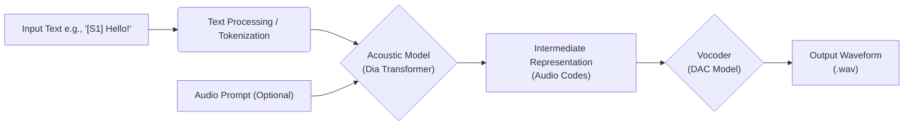
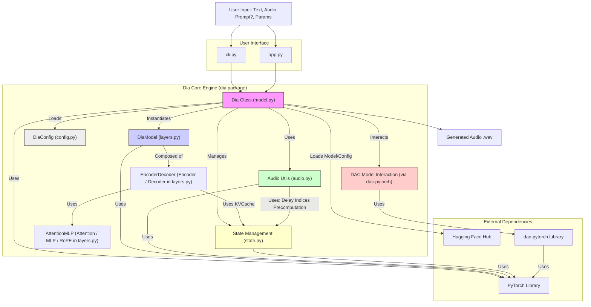
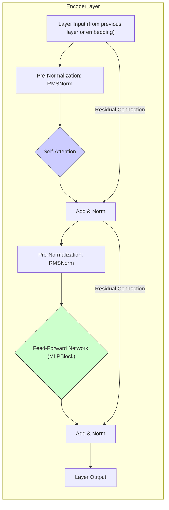
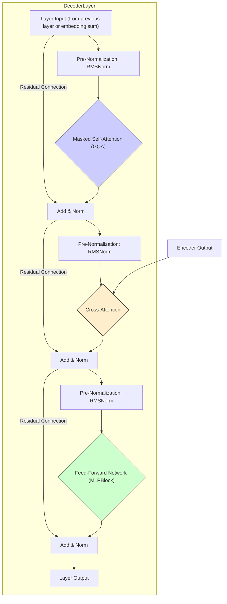
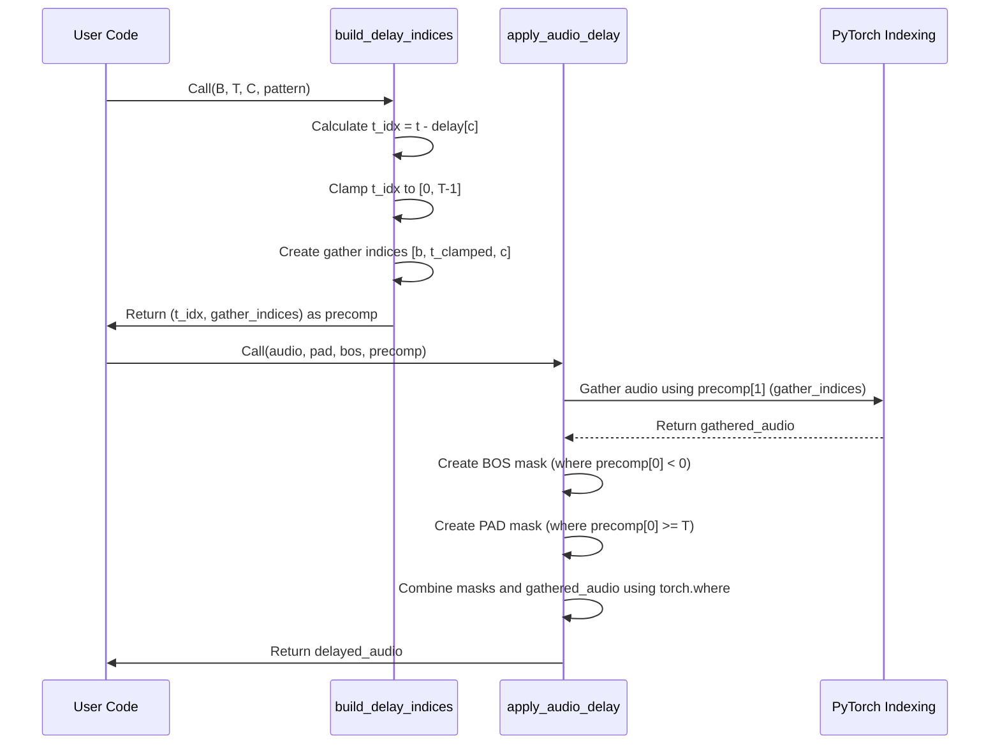
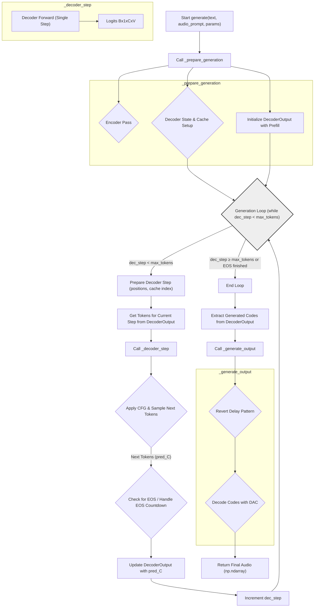
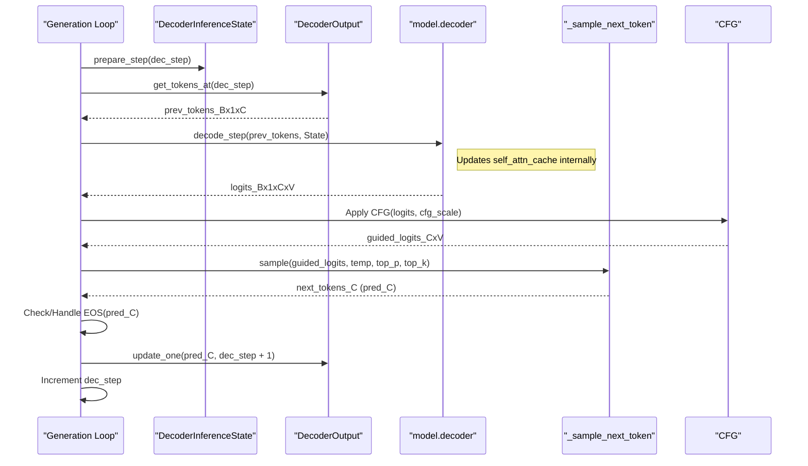

# Dia Explained

# Dia TTS: A Deep Dive into Text-to-Dialogue Synthesis

*   **Introduction**
    *   What is Dia TTS?
    *   Core Features (Dialogue, Voice Cloning)
    *   Target Audience
    *   Prerequisites (Assumed and Covered)
    *   Book Structure
*   **Chapter 1: Getting Started**
    *   Installation
    *   Running the Command-Line Interface (`cli.py`)
    *   Running the Gradio Web Interface (`app.py`)
    *   Basic Input and Output
*   **Chapter 2: Fundamental Concepts**
    *   The Text-to-Speech Pipeline
    *   Transformers for Speech: Encoder-Decoder Architecture
    *   The Role of Audio Codecs (DAC)
    *   Dialogue Synthesis with Speaker Tags (`[S1]`, `[S2]`)
    *   Voice Cloning via Audio Prompts
    *   Classifier-Free Guidance (CFG) Explained
    *   Audio Token Generation and Sampling (Temperature, Top-P)
    *   Introduction to the Delay Pattern Mechanism
*   **Chapter 3: System Architecture Overview**
    *   Codebase Structure (`dia/`, `app.py`, `cli.py`)
    *   High-Level Component Interaction
    *   Diagram: System Block Diagram
    *   The Central `Dia` Class (`dia/model.py`)
*   **Chapter 4: Configuration Deep Dive (`dia/config.py`)**
    *   Using Pydantic for Configuration
    *   `DataConfig`: Text/Audio Lengths, Channels, Padding/Special Tokens, Delay Pattern
    *   `EncoderConfig` & `DecoderConfig`: Layer Dimensions, Heads
    *   `ModelConfig`: Vocab Sizes, Dropout, RoPE Timescales
    *   `DiaConfig`: The Master Configuration
    *   Loading and Saving Configurations
*   **Chapter 5: The Transformer Encoder (`dia/layers.py`)**
    *   Purpose of the Encoder (Text Representation)
    *   Text Embedding (`nn.Embedding`)
    *   `EncoderLayer` Breakdown
        *   Normalization (`RMSNorm`)
        *   Self-Attention (`Attention` Module)
            *   Rotary Positional Embeddings (`RotaryEmbedding`)
        *   Feed-Forward Network (`MlpBlock`)
    *   The `Encoder` Module Structure
    *   Diagram: `EncoderLayer` Architecture
*   **Chapter 6: The Transformer Decoder (`dia/layers.py`)**
    *   Purpose of the Decoder (Generating Audio Tokens)
    *   Multi-Channel Embeddings
    *   `DecoderLayer` Breakdown
        *   Normalization (`RMSNorm`)
        *   Masked Self-Attention (`Attention` with GQA & Caching)
        *   Cross-Attention (`Attention` Module Querying Encoder)
        *   Feed-Forward Network (`MlpBlock`)
    *   The `Decoder` Module Structure
    *   Output Logits Projection (`DenseGeneral`)
    *   Diagram: `DecoderLayer` Architecture
*   **Chapter 7: Handling Audio Tokens: The Delay Pattern (`dia/audio.py`)**
    *   Rationale Behind the Delay Pattern
    *   Applying the Delay (`build_delay_indices`, `apply_audio_delay`)
    *   Reverting the Delay (`build_revert_indices`, `revert_audio_delay`)
    *   Interaction with BOS/PAD Tokens
    *   Diagram: Illustration of Delay Application/Reversion
*   **Chapter 8: The Inference Pipeline (`dia/model.py`, `dia/state.py`)**
    *   The `generate()` Method Flow
    *   Diagram: `generate()` Flowchart
    *   Input Preparation
        *   Text Processing (`_prepare_text_input`)
        *   Audio Prompt Processing (`load_audio`, `_prepare_audio_prompt`)
    *   Encoder Pass and State (`EncoderInferenceState`)
    *   Decoder Setup
        *   Precomputing Cross-Attention Cache (`precompute_cross_attn_cache`)
        *   Initializing Decoder State (`DecoderInferenceState`, `KVCache`)
        *   Handling Prefill Data (`DecoderOutput`)
    *   Autoregressive Decoding Loop
        *   The `_decoder_step` Function
        *   KV Caching (`KVCache.update`)
        *   Applying CFG
        *   Sampling (`_sample_next_token`)
        *   Handling EOS and Delay Pattern during Generation
        *   Diagram: Decoder Step Sequence Diagram
    *   Output Generation
        *   Reverting Delay (`_generate_output`)
        *   DAC Decoding (`dia.audio.decode`)
*   **Chapter 9: Interfaces: CLI and Web UI**
    *   Command-Line Interface (`cli.py`)
        *   Argument Parsing (`argparse`)
        *   Model Loading Options (Hub vs. Local)
        *   Running Inference and Saving Output
    *   Gradio Web Interface (`app.py`)
        *   UI Layout (`gr.Blocks`, `gr.Row`, `gr.Column`, etc.)
        *   Input Components (Textbox, Audio, Sliders)
        *   The `run_inference` Function
            *   Handling Audio Prompts (Preprocessing, Temp Files)
            *   Calling `model.generate`
            *   Post-processing (Speed Adjustment, Format Conversion)
        *   Examples Integration (`gr.Examples`)
*   **Chapter 10: Usage Examples (`example/`)**
    *   Simple Generation (`example/simple.py`)
    *   Voice Cloning (`example/voice_clone.py`)
    *   Code Walkthrough and Explanation
*   **Conclusion**
    *   Summary of Dia TTS Capabilities
    *   Key Architectural Choices
    *   Potential Next Steps / Future Directions
*   **(Optional) Glossary**
    *   Key Terms (CFG, RoPE, GQA, DAC, Delay Pattern, etc.)

---

# Dia TTS: A Deep Dive into Text-to-Dialogue Synthesis

## Introduction

Welcome to the comprehensive guide for the Dia Text-to-Speech (TTS) system. Dia stands out as an open-weights model specifically designed for generating dialogue, offering nuanced control over scripts and voices. This book aims to explain how Dia works from the ground up.

### What is Dia TTS?

Dia is a sophisticated deep learning model that converts written text, particularly dialogue scripts, into audible speech. It leverages a powerful transformer-based architecture, similar to those used in state-of-the-art natural language processing, but adapted for the nuances of audio generation. Given input text, potentially annotated with speaker tags like `[S1]` and `[S2]`, Dia produces audio tokens which are then converted into a final audio waveform using a separate high-fidelity audio codec (specifically, the Descript Audio Codec, or DAC).

### Core Features

*   **Dialogue Synthesis:** Excels at generating conversations between multiple speakers, identified using simple tags in the input text.
*   **Voice Cloning:** Can condition its output voice on a short audio prompt, allowing it to mimic the speaker characteristics from the prompt.
*   **High-Quality Audio:** Utilizes the Descript Audio Codec (DAC) for converting generated tokens into clear, high-fidelity audio waveforms (44.1kHz).
*   **Controllable Generation:** Offers parameters like Classifier-Free Guidance (CFG) scale, temperature, and Top-P sampling to fine-tune the output style and adherence to the prompt.
*   **Open Weights:** The model weights are publicly available, encouraging research and experimentation.
*   **User Interfaces:** Provides both a command-line tool (`cli.py`) for scripting and integration, and an interactive Gradio web UI (`app.py`) for easy experimentation.

### Target Audience

This book is primarily intended for:

*   **Software Engineers & Researchers:** Interested in understanding the inner workings of a modern TTS system.
*   **Machine Learning Practitioners:** Exploring transformer applications beyond NLP, specifically in audio generation.
*   **Students:** Learning about deep learning for audio and speech synthesis.
*   **Hobbyists:** Keen on experimenting with cutting-edge TTS technology.

### Prerequisites (Assumed and Covered)

**Assumed:**

*   Intermediate proficiency in Python programming.
*   Basic understanding of deep learning concepts (neural networks, layers, inference).
*   Familiarity with command-line usage.
*   Basic knowledge of Git for code access (optional).

**Covered within this book:**

*   Core concepts of the Transformer architecture (self-attention, cross-attention, encoder-decoder).
*   Fundamentals of Text-to-Speech pipelines and audio codecs (DAC).
*   Explanation of Classifier-Free Guidance (CFG).
*   Details of sampling methods (Temperature, Top-P).
*   The specific "Delay Pattern" mechanism used in Dia.
*   An overview of necessary libraries like PyTorch, Gradio, and Hugging Face Hub where relevant to the codebase.

### Book Structure

This book follows a top-down approach:

1.  **Getting Started:** Quick installation and running basic examples.
2.  **Fundamental Concepts:** Explaining the core ideas behind Dia *before* diving into code.
3.  **System Architecture:** A high-level overview of how the components fit together.
4.  **Configuration:** Detailing the settings that control the model's behavior.
5.  **Encoder & Decoder:** Deep dives into the neural network architecture (the transformer).
6.  **Delay Pattern:** Unpacking the unique mechanism for handling audio tokens.
7.  **Inference Pipeline:** Tracing the step-by-step process of generating audio from text.
8.  **Interfaces:** Examining the CLI and Gradio UI code.
9.  **Examples:** Walking through practical usage scenarios.
10. **Conclusion:** Summarizing key takeaways.

Our goal is to provide a clear, accurate, and self-contained guide to understanding and potentially extending the Dia TTS system.

---

## Chapter 1: Getting Started

This chapter provides instructions on how to set up the necessary environment and run the Dia TTS model using both its command-line interface (CLI) and the Gradio web interface.

### Installation

Before running Dia, you need to install the required Python libraries. It's highly recommended to use a virtual environment (like `venv` or `conda`) to avoid conflicts with other projects.

1.  **Clone the Repository (if you haven't already):**
    ```bash
	git clone https://github.com/nari-labs/dia
    cd dia
    ```
    *(Assuming you have the code files provided)*

2.  **Create and Activate a Virtual Environment (Recommended):**
    *   Using `venv`:
        ```bash
        python -m venv venv
        source venv/bin/activate  # On Windows: venv\Scripts\activate
        ```
    *   Using `conda`:
        ```bash
        conda create -n dia_env python=3.9 # Or desired version
        conda activate dia_env
        ```

3.  **Install Dependencies:**
    The primary dependencies include `torch`, `torchaudio`, `dac-pytorch`, `soundfile`, `numpy`, `gradio`, `huggingface_hub`, and `pydantic`. You can usually install these via pip. Ensure you install the correct PyTorch version for your hardware (CPU, CUDA, MPS). Visit the [PyTorch website](https://pytorch.org/) for specific installation commands.

    ```bash
    # Example installation (adjust PyTorch command based on your system)
    pip install torch torchaudio --index-url https://download.pytorch.org/whl/cu118 # Example for CUDA 11.8
    pip install dac-pytorch soundfile numpy gradio huggingface_hub pydantic transformers # Added transformers as it's often needed implicitly

    # Or, if a requirements.txt file is provided:
    # pip install -r requirements.txt
    ```

### Running the Command-Line Interface (`cli.py`)

The `cli.py` script allows you to generate audio directly from your terminal.

**Basic Usage:**

```bash
python cli.py "Your input text goes here." --output generated_audio.wav
```

This command will:

1.  Download the default Dia model (`nari-labs/Dia-1.6B`) from Hugging Face Hub.
2.  Generate audio for the provided text.
3.  Save the output waveform to `generated_audio.wav`.

**Key CLI Arguments:**

*   `text` (Positional): The input text for speech generation (required). Use speaker tags like `[S1]` and `[S2]` for dialogue.
*   `--output` (Required): Path to save the generated audio file (e.g., `output.wav`).
*   `--repo-id`: Specify a different Hugging Face model repository (default: `nari-labs/Dia-1.6B`).
*   `--local-paths`: Use local config and checkpoint files instead of downloading. Requires `--config` and `--checkpoint`.
*   `--config`: Path to local `config.json`.
*   `--checkpoint`: Path to local `.pth` model file.
*   `--audio-prompt`: Path to a WAV file to use as an audio prompt for voice cloning.
*   `--max-tokens`: Maximum audio tokens (length) to generate.
*   `--cfg-scale`: Classifier-Free Guidance scale (default: 3.0). Higher values increase prompt adherence.
*   `--temperature`: Sampling randomness (default: 1.3). Higher values increase randomness.
*   `--top-p`: Nucleus sampling probability (default: 0.95).
*   `--seed`: Set a random seed for reproducible results.
*   `--device`: Force inference device (e.g., `cuda`, `cpu`, `mps`). Defaults to auto-detection.

**Example with Voice Prompt:**

```bash
python cli.py "[S1] This is a test using a voice prompt. [S2] It should sound similar." --output prompted_audio.wav --audio-prompt ./example_prompt.mp3
```
*(Requires an audio file named `example_prompt.mp3` in the same directory or provided path)*

### Running the Gradio Web Interface (`app.py`)

The `app.py` script launches a user-friendly web interface using Gradio.

**Launching the UI:**

```bash
python app.py
```

This command will:

1.  Load the default Dia model (or use a forced device if specified).
2.  Start a local web server.
3.  Print a URL (usually `http://127.0.0.1:7860` or similar) that you can open in your web browser.

**Using the Interface:**

*   **Input Text:** Enter the text you want to synthesize, using `[S1]`, `[S2]`, etc., for different speakers.
*   **Audio Prompt (Optional):** Upload an audio file or record directly using your microphone to provide a voice prompt for cloning.
*   **Generation Parameters:** Expand the accordion to adjust parameters like audio length (`Max New Tokens`), CFG scale, temperature, Top-P, and speed factor. Hover over the labels for detailed information.
*   **Generate Audio:** Click the button to start the synthesis process.
*   **Generated Audio:** The output audio will appear in the player once generation is complete.

**Key UI Arguments:**

*   `--device`: Force a specific compute device (e.g., `cuda`, `cpu`).
*   `--share`: If you run `python app.py --share`, Gradio will generate a temporary public URL to share your interface (use with caution).

### Basic Input and Output

*   **Input Text:** Plain text, ideally with speaker tags like `[S1]` and `[S2]` to indicate different speakers in a dialogue. Punctuation and capitalization can influence the prosody.
*   **Audio Prompt (Optional):** A short audio sample (usually WAV or MP3) containing the voice you want the model to mimic. The content of the prompt audio doesn't necessarily need to match the input text.
*   **Output Audio:** A single-channel (mono) audio waveform, typically saved as a `.wav` file (by `cli.py`) or presented in the Gradio player, with a sample rate of 44100 Hz.

Now that you know how to run Dia, the next chapter will delve into the fundamental concepts that underpin its operation.

---

## Chapter 2: Fundamental Concepts

Before dissecting the Dia codebase line by line, it's crucial to understand the core concepts driving modern Text-to-Speech (TTS) systems like Dia. This chapter provides the necessary background.

### The Text-to-Speech Pipeline

Generating speech from text is typically a multi-stage process:

1.  **Text Processing:** The input text is cleaned, normalized (e.g., expanding abbreviations, numbers), and often converted into a sequence of phonemes or other linguistic units. In Dia's case, the input text (including speaker tags) is directly converted into byte tokens.
2.  **Acoustic Modeling:** A neural network (the main Transformer model in Dia) takes the processed text representation and generates an intermediate representation of the audio. This isn't the final waveform yet, but rather features like mel-spectrograms or, in Dia's case, discrete *audio tokens* or *codes*. This stage determines the prosody, rhythm, and speaker characteristics.
3.  **Vocoding/Synthesis:** Another component (often called a vocoder or synthesizer) takes the intermediate acoustic representation and converts it into the final audible audio waveform. Dia uses an external model, the Descript Audio Codec (DAC), for this step.


*Diagram: Simplified TTS Pipeline for Dia*

### Transformers for Speech: Encoder-Decoder Architecture

Dia employs a **Transformer** model, an architecture that revolutionized natural language processing and has proven highly effective for sequence-to-sequence tasks like TTS. Dia uses a specific variant: the **Encoder-Decoder** structure.

*   **Encoder:** Reads the input text sequence (byte tokens). Its job is to build a rich, context-aware representation of the input text. It uses self-attention mechanisms to understand relationships between different parts of the text.
*   **Decoder:** Takes the encoder's output representation and generates the output sequence – in this case, the audio tokens – one step at a time (autoregressively). It uses two types of attention:
    *   **Masked Self-Attention:** Attends to the previously generated audio tokens to maintain coherence in the output audio sequence. The "masking" prevents it from "cheating" by looking at future tokens.
    *   **Cross-Attention:** Attends to the encoder's output. This allows the decoder to align the generated audio tokens with the corresponding parts of the input text, ensuring the synthesized speech accurately reflects the text content.

We will explore the specific layers (`EncoderLayer`, `DecoderLayer`) in Chapters 5 and 6.

### The Role of Audio Codecs (DAC)

Generating raw audio waveforms directly from a Transformer is computationally expensive and often produces lower-fidelity results. Instead, many modern TTS systems generate a compressed or intermediate representation first.

Dia generates sequences of discrete **audio codes**. These codes represent compressed information about the audio signal. To turn these codes back into an audible waveform, Dia relies on the **Descript Audio Codec (DAC)**.

*   **DAC Encoder:** Takes a real audio waveform and compresses it into discrete codes (used for preparing audio prompts).
*   **DAC Decoder:** Takes discrete codes generated by the Dia Transformer and synthesizes the final high-fidelity audio waveform (44.1kHz).

Think of DAC as a specialized compression/decompression system optimized for audio, allowing the main Dia Transformer to focus on the linguistic and prosodic aspects rather than the raw signal generation. Dia interacts with DAC via the `dac-pytorch` library.

### Dialogue Synthesis with Speaker Tags (`[S1]`, `[S2]`)

Dia is designed for dialogue. It recognizes special tags like `[S1]` and `[S2]` within the input text. These tags signal a change in speaker. The model learns to associate different voice characteristics (pitch, tone) with different speaker tags, allowing it to generate conversations with distinct voices for each participant.

During text preparation (`_prepare_text_input` in `dia/model.py`), these tags are converted into specific byte values (`\x01` for `[S1]`, `\x02` for `[S2]`) which the model processes as part of the input sequence.

### Voice Cloning via Audio Prompts

One of Dia's powerful features is zero-shot voice cloning. By providing a short audio sample (the "audio prompt"), you can guide the model to generate the target text in a voice similar to the one in the prompt.

How it works (conceptually):

1.  The audio prompt is loaded and processed by the **DAC Encoder** to get its corresponding sequence of audio codes.
2.  These prompt audio codes are fed into the Dia **Decoder** as an initial prefix or context *before* it starts generating codes for the target text.
3.  The Decoder's attention mechanisms implicitly capture the acoustic characteristics represented by these prompt codes and continue generating subsequent codes (for the target text) with similar characteristics.

The actual implementation involves preparing these prompt codes and feeding them into the decoder's generation loop, as seen in `_prepare_audio_prompt` and the `generate` method in `dia/model.py`.

### Classifier-Free Guidance (CFG) Explained

Classifier-Free Guidance (CFG) is a technique used during inference to improve the model's adherence to the input condition (the text prompt) and potentially enhance sample quality. It's widely used in diffusion models but also applicable here.

How it works in Dia (`_decoder_step` in `dia/model.py`):

1.  **Two Forward Passes:** For each decoding step, the model performs *two* forward passes through the decoder:
    *   **Conditional Pass:** Using the actual text prompt embedding provided by the encoder.
    *   **Unconditional Pass:** Using a generic, neutral embedding (like a zero vector or padding tokens, representing "no specific text prompt").
2.  **Calculate Guidance:** The model calculates the difference between the conditional logits (output probabilities for the next token given the text) and the unconditional logits (output probabilities without text guidance). This difference represents the "direction" the text prompt is pushing the probabilities.
3.  **Apply Guidance:** This difference vector is scaled by the `cfg_scale` factor and added back to the *conditional* logits.
    ```
    # Simplified Concept
    guided_logits = conditional_logits + cfg_scale * (conditional_logits - unconditional_logits)
    ```
4.  **Sample:** The next audio token is sampled based on these adjusted, `guided_logits`.

*   A `cfg_scale` of 0 means no guidance (equivalent to the unconditional prediction).
*   A `cfg_scale` of 1 means using the original conditional prediction.
*   A `cfg_scale` > 1 increases the influence of the text prompt, making the output adhere more strictly to the text, potentially at the cost of some naturalness or diversity. The `cli.py` and `app.py` defaults are around 3.0.

### Audio Token Generation and Sampling (Temperature, Top-P)

The Decoder doesn't output a single "best" audio token at each step. Instead, it outputs *logits* – raw scores for every possible audio token in its vocabulary (size `tgt_vocab_size`, typically 1028 in Dia). To select the *actual* next token, a sampling strategy is used:

1.  **Softmax:** Logits are converted into probabilities using the softmax function.
2.  **Temperature Scaling:** Before softmax, logits are divided by a `temperature` value.
    *   `temperature < 1.0`: Sharpens the probability distribution, making high-probability tokens even more likely (more deterministic, less random).
    *   `temperature = 1.0`: Uses the original probabilities.
    *   `temperature > 1.0`: Flattens the distribution, making lower-probability tokens more likely (more random, diverse, potentially surprising). Dia defaults to 1.3.
3.  **Top-P (Nucleus) Sampling:** Instead of considering all tokens, Top-P sampling selects the *smallest set* of tokens whose cumulative probability exceeds a threshold `top_p`. Tokens outside this "nucleus" set are discarded (their probability is set to zero). Sampling then occurs only from the tokens within the nucleus.
    *   `top_p = 1.0`: Considers all tokens.
    *   `top_p < 1.0`: Reduces the chance of picking very low-probability, potentially nonsensical tokens, leading to more coherent output. Dia defaults to 0.95.
4.  **Multinomial Sampling:** A single token is randomly chosen from the final adjusted probability distribution (after temperature and Top-P).

These sampling parameters (`temperature`, `top_p`) allow fine-tuning the trade-off between coherence, diversity, and randomness in the generated audio. This logic resides in the `_sample_next_token` function in `dia/model.py`.

### Introduction to the Delay Pattern Mechanism

Dia employs a somewhat unique mechanism involving a "delay pattern" (`delay_pattern` in `DataConfig`). This pattern is a list of integers, one for each audio channel/codebook (Dia uses 9 channels, configured in `DataConfig.channels`).

Conceptually, during processing:

*   **Applying Delay (`apply_audio_delay`):** The token at time `t` for channel `c` is effectively treated as if it occurred at time `t - delay[c]`. This shifts the tokens relative to each other across channels. Special BOS (Beginning of Sequence) and PAD (Padding) tokens are inserted where the shifted time index would be invalid (negative or beyond sequence length).
*   **Reverting Delay (`revert_audio_delay`):** After the model generates the delayed tokens, this operation shifts them back to their original temporal alignment before decoding them with DAC.

The exact purpose might be related to structured dropout during training, encouraging different codebooks to learn complementary information, or enabling a form of parallel prediction across codebooks during inference. We will examine the implementation details in `dia/audio.py` in Chapter 7.

With these foundational concepts in mind, we can now move on to understanding the overall structure of the Dia codebase.

---

## Chapter 3: System Architecture Overview

This chapter provides a high-level view of the Dia TTS codebase, illustrating how the different Python modules and classes collaborate to achieve text-to-dialogue synthesis.

### Codebase Structure

The project is organized into several key parts:

*   **`dia/` package:** Contains the core logic of the TTS model.
    *   `model.py`: Defines the main `Dia` class, orchestrating the entire inference process, including loading, input preparation, generation loop, and DAC interaction.
    *   `layers.py`: Implements the fundamental building blocks of the transformer network (Attention, MLP, Embeddings, Encoder/Decoder Layers, `DiaModel`).
    *   `config.py`: Defines Pydantic data classes (`DiaConfig`, `ModelConfig`, etc.) for managing model and data configuration.
    *   `audio.py`: Contains functions for handling the specific audio token delay pattern (`apply_audio_delay`, `revert_audio_delay`) and for decoding tokens using the DAC model (`decode`).
    *   `state.py`: Defines data classes (`EncoderInferenceState`, `DecoderInferenceState`, `KVCache`, `DecoderOutput`) to manage the state information required during the autoregressive inference process (like KV caches, positions, masks).
    *   `__init__.py`: Makes the `Dia` class easily importable from the package.
*   **`app.py`:** Implements the Gradio web user interface, providing an interactive way to use the Dia model.
*   **`cli.py`:** Implements the command-line interface, suitable for scripting and batch processing.
*   **`example/` directory:** Contains simple scripts (`simple.py`, `voice_clone.py`) demonstrating basic usage of the `Dia` class.
*   **(Potentially)** Configuration files (`config.json`) and model checkpoint files (`.pth`).

### High-Level Component Interaction

The diagram below illustrates the flow of data and control during inference:


*Diagram: High-Level System Block Diagram*

**Flow Explanation:**

1.  **User Input:** The user provides text, optional audio prompt, and generation parameters via either the CLI (`cli.py`) or the Web UI (`app.py`).
2.  **Interface Layer:** The interface script (`cli.py` or `app.py`) parses the input and parameters.
3.  **`Dia` Class Orchestration (`model.py`):**
    *   An instance of the `Dia` class is created. It loads the configuration (`DiaConfig`) and potentially downloads/loads model weights (`.pth` file) using Hugging Face Hub or local paths.
    *   It instantiates the core PyTorch model (`DiaModel` from `layers.py`).
    *   It loads the external DAC model using the `dac-pytorch` library.
    *   The `generate` method is called with the user inputs.
4.  **Inference Process (within `generate`):**
    *   Inputs (text, audio prompt) are preprocessed (tokenized, encoded using DAC if needed) using methods within `Dia` and potentially `AudioUtils`.
    *   Inference state is initialized (`StateMgmt`).
    *   The `DiaModel` (Encoder + Decoder) performs the forward passes, managed step-by-step by the `Dia` class. This heavily relies on PyTorch.
        *   The Encoder processes the text.
        *   The Decoder generates audio tokens autoregressively, using self-attention, cross-attention (querying the encoder output), and KV caching (`StateMgmt`). CFG is applied here.
    *   The unique delay pattern is applied and reverted using `AudioUtils`.
    *   Sampling (`_sample_next_token`) selects the next token at each step.
5.  **DAC Decoding:** The final generated audio tokens (after reverting the delay) are passed to the loaded DAC model's decoder (`AudioUtils.decode`).
6.  **Output:** The DAC decoder produces the final audio waveform, which is returned by the `Dia` class and then saved to a file (`cli.py`) or presented to the user (`app.py`).

### The Central `Dia` Class (`dia/model.py`)

The `Dia` class acts as the main entry point and orchestrator for the core TTS functionality. It encapsulates:

*   Model loading (`from_pretrained`, `from_local`).
*   DAC model management (`_load_dac_model`).
*   Input preparation (`_prepare_text_input`, `_prepare_audio_prompt`, `load_audio`).
*   The main generation logic loop (`generate`).
*   Interaction with the underlying `DiaModel` (the PyTorch `nn.Module`).
*   State management initialization and updates during inference.
*   Application of CFG and sampling (`_decoder_step`, `_sample_next_token`).
*   Final audio conversion using DAC (`_generate_output`).
*   Saving audio (`save_audio`).

Understanding the `Dia` class and its `generate` method is key to grasping the overall inference flow, which we will explore in detail in Chapter 8.

Next, we will examine the configuration system that governs the behavior and architecture of the Dia model.

---

## Chapter 4: Configuration Deep Dive (`dia/config.py`)

The `dia/config.py` module defines the configuration structure for the Dia model using the Pydantic library. Pydantic allows for data validation and settings management through Python type annotations, making the configuration robust and easier to manage.

### Using Pydantic for Configuration

Pydantic models are classes that inherit from `BaseModel`. Fields are defined using standard Python type hints. Pydantic automatically validates data against these types when an instance of the model is created or loaded.

Key features used in `dia/config.py`:

*   **Type Hinting:** Standard types (`int`, `float`, `str`, `list`) define expected data types.
*   **Validation:** Pydantic automatically checks if provided values match the types. Field constraints (`gt=0`, `ge=0`, `multiple_of=128`) add further validation rules.
*   **Defaults:** Default values can be provided using `Field(default=...)` or direct assignment. `default_factory` allows dynamic default creation (like an empty list).
*   **Immutability (`frozen=True`):** The `BaseModel, frozen=True` pattern makes config instances immutable after creation, preventing accidental changes during runtime.
*   **Serialization/Deserialization:** Pydantic models can be easily loaded from (`model_validate_json`) and saved to (`model_dump_json`) JSON format.
*   **Nested Models:** Configurations are organized hierarchically by nesting Pydantic models (e.g., `DiaConfig` contains `ModelConfig`, which contains `EncoderConfig` and `DecoderConfig`).
*   **Custom Validators (`BeforeValidator`):** Used here to enforce specific constraints, like ensuring `text_length` and `audio_length` are multiples of 128 *before* standard validation.

### `DataConfig`

This class holds parameters related to data processing and dimensions.

```python
# Simplified from dia/config.py
class DataConfig(BaseModel, frozen=True):
    text_length: Annotated[int, BeforeValidator(lambda x: (x + 127) // 128 * 128)] = Field(gt=0, multiple_of=128)
    audio_length: Annotated[int, BeforeValidator(lambda x: (x + 127) // 128 * 128)] = Field(gt=0, multiple_of=128)
    channels: int = Field(default=9, gt=0, multiple_of=1)
    text_pad_value: int = Field(default=0)
    audio_eos_value: int = Field(default=1024)
    audio_pad_value: int = Field(default=1025)
    audio_bos_value: int = Field(default=1026)
    delay_pattern: list[Annotated[int, Field(ge=0)]] = Field(default_factory=lambda: [0, 8, 9, 10, 11, 12, 13, 14, 15])
```

*   `text_length`: Maximum number of tokens allowed in the input text sequence. Validated to be a multiple of 128.
*   `audio_length`: Maximum number of audio tokens (time steps) the model can handle or generate. Also validated to be a multiple of 128. This relates to the maximum attention span.
*   `channels`: The number of parallel audio codebooks used by the model and the DAC. Dia uses 9.
*   `text_pad_value`: The token ID used for padding shorter text sequences.
*   `audio_eos_value`, `audio_pad_value`, `audio_bos_value`: Special token IDs used for End-of-Sequence, Padding, and Beginning-of-Sequence markers in the audio token sequences.
*   `delay_pattern`: The list defining the time delays for each of the `channels`. This is crucial for the delay mechanism discussed in Chapter 2 and detailed in Chapter 7. The default `[0, 8, ..., 15]` indicates varying delays across the 9 channels.

### `EncoderConfig` & `DecoderConfig`

These classes define the architectural parameters of the Transformer's encoder and decoder modules, respectively.

```python
# Simplified from dia/config.py
class EncoderConfig(BaseModel, frozen=True):
    n_layer: int = Field(gt=0)       # Number of layers in the encoder stack
    n_embd: int = Field(gt=0)        # Embedding dimension
    n_hidden: int = Field(gt=0)      # Intermediate dimension in MLP blocks
    n_head: int = Field(gt=0)        # Number of attention heads
    head_dim: int = Field(gt=0)      # Dimension of each attention head

class DecoderConfig(BaseModel, frozen=True):
    n_layer: int = Field(gt=0)       # Number of layers in the decoder stack
    n_embd: int = Field(gt=0)        # Embedding dimension
    n_hidden: int = Field(gt=0)      # Intermediate dimension in MLP blocks
    # Grouped-Query Attention (Self-Attention) parameters
    gqa_query_heads: int = Field(gt=0) # Number of query heads
    kv_heads: int = Field(gt=0)        # Number of key/value heads (shared across groups)
    gqa_head_dim: int = Field(gt=0)    # Dimension of each query/key/value head
    # Cross-Attention parameters
    cross_query_heads: int = Field(gt=0) # Number of query heads
    cross_head_dim: int = Field(gt=0)    # Dimension of each cross-attention head
```

These parameters control the size and capacity of the model. Larger dimensions and more layers generally lead to a more powerful model but also increase computational cost and memory usage. Note the distinct parameters for self-attention (using Grouped-Query Attention, GQA) and cross-attention in the decoder.

### `ModelConfig`

This class aggregates the encoder/decoder configurations and adds model-wide parameters.

```python
# Simplified from dia/config.py
class ModelConfig(BaseModel, frozen=True):
    encoder: EncoderConfig
    decoder: DecoderConfig
    src_vocab_size: int = Field(default=128, gt=0) # Size of text input vocabulary (bytes + special tokens)
    tgt_vocab_size: int = Field(default=1028, gt=0)# Size of audio token vocabulary (DAC codes + special tokens)
    dropout: float = Field(default=0.0, ge=0.0, lt=1.0) # Dropout rate (usually 0 during inference)
    normalization_layer_epsilon: float = Field(default=1.0e-5, ge=0.0) # Epsilon for RMSNorm stability
    weight_dtype: str = Field(default="float32", description="Weight precision") # Data type for weights
    rope_min_timescale: int = Field(default=1, ...) # Min timescale for RoPE
    rope_max_timescale: int = Field(default=10_000, ...) # Max timescale for RoPE
```

*   `src_vocab_size`: Size of the vocabulary for the text encoder input (typically 256 for bytes, but Dia uses 128, potentially indicating a different text tokenization or a subset).
*   `tgt_vocab_size`: Size of the vocabulary for the audio decoder output. This corresponds to the number of possible discrete codes from the DAC quantizer (e.g., 1024) plus special tokens (EOS, PAD, BOS). Dia uses 1028 (1024 codes + 4 special tokens likely).
*   `dropout`: Dropout probability (typically only used during training).
*   `normalization_layer_epsilon`: Small value added to the variance in `RMSNorm` layers for numerical stability.
*   `weight_dtype`: Precision used for model weights (e.g., `float32`, `float16`, `bfloat16`). Affects memory usage and computation speed.
*   `rope_..._timescale`: Parameters controlling the Rotary Positional Embeddings (RoPE) used in the attention layers.

### `DiaConfig`

This is the top-level configuration class, bringing everything together.

```python
# Simplified from dia/config.py
class DiaConfig(BaseModel, frozen=True):
    version: str = Field(default="1.0")
    model: ModelConfig
    training: TrainingConfig # Placeholder for potential training params (not used in inference code)
    data: DataConfig

    def save(self, path: str) -> None: ... # Saves config to JSON
    @classmethod
    def load(cls, path: str) -> "DiaConfig | None": ... # Loads config from JSON
```

It holds the `ModelConfig`, `DataConfig`, and a placeholder `TrainingConfig`. The `save` and `load` methods provide convenient ways to persist and retrieve configurations from JSON files (like the `config.json` downloaded from Hugging Face Hub).

Understanding this configuration structure is essential, as these values dictate the architecture and behavior of the `DiaModel` constructed in `dia/layers.py` and used by `dia/model.py`.

---

## Chapter 5: The Transformer Encoder (`dia/layers.py`)

The Encoder's role in Dia is to process the input text sequence (including speaker tags, represented as byte tokens) and generate a sequence of contextual embeddings. These embeddings capture the meaning and relationships within the text and serve as the input condition for the Decoder.

The implementation resides primarily within the `Encoder` and `EncoderLayer` classes in `dia/layers.py`.

### Text Embedding (`nn.Embedding`)

The first step in the encoder is to convert the discrete input token IDs into continuous vector representations (embeddings).

```python
# In Encoder.__init__
self.embedding = nn.Embedding(
    model_config.src_vocab_size, # e.g., 128
    enc_config.n_embd,          # e.g., 2048
    dtype=compute_dtype,
)
# In Encoder.forward
x = self.embedding(x_ids) # x_ids shape: [B, T_text], x shape: [B, T_text, D_emb]
```

*   `model_config.src_vocab_size`: The number of possible input tokens (defined in `ModelConfig`).
*   `enc_config.n_embd`: The dimensionality of the embedding vectors (defined in `EncoderConfig`).
*   Each token ID in the input sequence `x_ids` is mapped to its corresponding embedding vector.

### `EncoderLayer` Breakdown

The encoder consists of a stack of identical `EncoderLayer` modules (`enc_config.n_layer` of them). Each layer refines the representations from the previous layer through two main sub-modules: self-attention and a feed-forward network.


*Diagram: Structure of an `EncoderLayer`*

**1. Pre-Normalization (`RMSNorm`)**

Before both the self-attention and MLP blocks, Layer Normalization is applied. Dia uses Root Mean Square Normalization (`RMSNorm`), a variant often found in modern large language models.

```python
# dia/layers.py RMSNorm import and usage
from torch.nn import RMSNorm # Note: Actual import might differ based on PyTorch version or custom implementation

# In EncoderLayer.__init__
self.pre_sa_norm = RMSNorm(embed_dim, eps=model_config.normalization_layer_epsilon, ...)
# In EncoderLayer.forward
residual = x
x_norm = self.pre_sa_norm(x) # Apply normalization
# ... pass x_norm to self_attention ...
```

Normalization stabilizes the activations and gradients during training and inference.

**2. Self-Attention (`Attention` Module)**

This is the core of the Transformer. The `Attention` module calculates how much each token in the sequence should attend to every other token (including itself). This allows the model to capture long-range dependencies and contextual relationships within the text.

```python
# In EncoderLayer.__init__
self.self_attention = Attention(
    config,
    q_embed_dim=embed_dim,
    kv_embed_dim=embed_dim,
    num_query_heads=enc_config.n_head,
    num_kv_heads=enc_config.n_head, # In encoder self-attn, query/key/value heads are usually the same
    head_dim=enc_config.head_dim,
    compute_dtype=compute_dtype,
    # ... other args ...
)
# In EncoderLayer.forward
sa_out = self.self_attention(
    Xq=x_norm, # Query
    Xkv=x_norm, # Key & Value (from the same sequence)
    q_positions=state.positions, # Positional information for queries
    kv_positions=state.positions, # Positional information for keys/values
    attn_mask=state.attn_mask, # Mask to handle padding
)
```

*   **Multi-Head Attention:** The attention mechanism is performed multiple times in parallel ("heads"), each focusing on different aspects of the relationships. The results are then combined.
*   **Query, Key, Value:** For each token, the model projects its embedding into three vectors: Query (Q), Key (K), and Value (V). The attention score between two tokens is calculated based on the similarity (dot product) of the Query of the first token and the Key of the second token. These scores determine how much of each token's Value vector contributes to the output representation of the first token.
*   **Rotary Positional Embeddings (`RotaryEmbedding`)**: Transformers need a way to understand the order of tokens. Dia uses RoPE, a relative positional encoding scheme applied directly to the Query and Key vectors within the attention mechanism. It modifies the Q and K vectors based on their absolute positions in a way that attention scores implicitly depend on the *relative* distance between tokens.
    ```python
    # Simplified view within Attention.forward
    # Projections:
    Xq_proj = self.q_proj(Xq) # Shape [B, T, N_head, H_dim]
    Xk_proj = self.k_proj(Xkv) # Shape [B, T, N_head, H_dim]
    Xv_proj = self.v_proj(Xkv) # Shape [B, T, N_head, H_dim]

    # Apply RoPE:
    Xq_rotated = self.rotary_emb(Xq_proj, position=q_positions)
    Xk_rotated = self.rotary_emb(Xk_proj, position=kv_positions)

    # Scaled Dot-Product Attention:
    attn_output = F.scaled_dot_product_attention(Xq_rotated, Xk_rotated, Xv_proj, attn_mask=attn_mask, ...)

    # Output Projection:
    output = self.o_proj(attn_output)
    ```
*   **Padding Mask (`attn_mask`):** Ensures that padding tokens in the input sequence do not participate in the attention calculation and do not influence the representations of real tokens. The mask is generated in `dia/state.py` using `create_attn_mask`.

**3. Residual Connection and Add (`Add & Norm`)**

After the self-attention block, a residual connection is used: the original input to the layer (`residual`) is added to the output of the attention block (`sa_out`).

```python
# In EncoderLayer.forward
x = residual + sa_out # Add residual connection
```

This helps with gradient flow during training and allows the network to learn modifications to the identity function easily. (Note: The diagram shows Add & *Norm*, but the code applies normalization *before* the sub-layer - "pre-norm" style).

**4. Feed-Forward Network (`MlpBlock`)**

Following the attention block and residual connection, the representation passes through another normalization (`post_sa_norm`, though named `pre_mlp_norm` might be clearer based on position) and then a position-wise Feed-Forward Network (FFN). This is implemented by the `MlpBlock`.

```python
# In EncoderLayer.__init__
self.mlp = MlpBlock(embed_dim=embed_dim, intermediate_dim=enc_config.n_hidden, ...)
# In EncoderLayer.forward
residual = x # Start next residual path
x_norm = self.post_sa_norm(x) # Pre-FFN normalization
mlp_out = self.mlp(x_norm)
x = residual + mlp_out # Add residual connection
```

The `MlpBlock` typically consists of two linear transformations with a non-linear activation function in between (SiLU - Sigmoid Linear Unit - in this case, fused within the `wi_fused` layer). It processes each token's representation independently.

```python
# Simplified MlpBlock.forward
fused_x = self.wi_fused(x) # Projects to 2 * intermediate_dim
gate = fused_x[..., 0, :]
up = fused_x[..., 1, :]
hidden = torch.mul(F.silu(gate), up) # Apply SiLU activation element-wise
output = self.wo(hidden) # Project back to embed_dim
```

**5. Layer Output:** The final output of the `EncoderLayer` is the result after the MLP block and its residual connection. This output serves as the input to the next `EncoderLayer` in the stack.

### The `Encoder` Module Structure

The `Encoder` class simply wraps the embedding layer and the stack of `EncoderLayer` modules, followed by a final normalization step.

```python
# Simplified Encoder structure
class Encoder(nn.Module):
    def __init__(self, config: DiaConfig, compute_dtype: torch.dtype):
        super().__init__()
        self.embedding = nn.Embedding(...)
        self.layers = nn.ModuleList([EncoderLayer(...) for _ in range(enc_config.n_layer)])
        self.norm = RMSNorm(...) # Final normalization

    def forward(self, x_ids: torch.Tensor, state: EncoderInferenceState) -> torch.Tensor:
        x = self.embedding(x_ids)
        for layer in self.layers:
            x = layer(x, state) # Pass through each layer
        x = self.norm(x) # Apply final normalization
        return x
```

The final output of the `Encoder` is the sequence of contextual embeddings `x` (shape `[Batch, TextLength, EmbDim]`), which holds the processed representation of the input text, ready to be consumed by the Decoder.

---

## Chapter 6: The Transformer Decoder (`dia/layers.py`)

The Decoder's primary function in Dia is to generate the sequence of audio tokens autoregressively, conditioned on the output of the Encoder. It predicts the next audio token based on the previously generated tokens and the contextual information from the input text provided by the Encoder.

The implementation is found in the `Decoder` and `DecoderLayer` classes in `dia/layers.py`.

### Multi-Channel Embeddings

A unique aspect of Dia's decoder is its handling of multiple audio channels (codebooks, `config.data.channels`, default 9). Instead of a single embedding layer, it has a separate `nn.Embedding` layer for *each channel*.

```python
# In Decoder.__init__
self.embeddings = nn.ModuleList(
    [
        nn.Embedding(model_config.tgt_vocab_size, dec_config.n_embd, ...)
        for _ in range(self.num_channels) # Create one embedding layer per channel
    ]
)

# In Decoder.forward (Prefill) / decode_step (Single Step)
# Simplified logic: Sum embeddings across channels
x = None
for i in range(self.num_channels):
    channel_tokens = tgt_ids[..., i] # Get tokens for channel i
    channel_embed = self.embeddings[i](channel_tokens) # Embed using channel-specific layer
    x = channel_embed if x is None else x + channel_embed # Sum embeddings
```

During the forward pass (both for the initial prefill and single decoding steps), the token IDs for each channel are embedded using their respective layers, and the resulting embeddings are summed together. This combined embedding represents the input for the decoder layers at that time step.

### `DecoderLayer` Breakdown

Similar to the Encoder, the Decoder consists of a stack of identical `DecoderLayer` modules (`dec_config.n_layer` of them). However, each `DecoderLayer` has *three* main sub-modules: masked self-attention, cross-attention, and the feed-forward network.


*Diagram: Structure of a `DecoderLayer`*

**1. Pre-Normalization (`RMSNorm`)**

As in the encoder, `RMSNorm` is applied before each sub-module (`pre_sa_norm`, `pre_ca_norm`, `pre_mlp_norm`).

**2. Masked Self-Attention (`Attention` with GQA & Caching)**

The first attention mechanism allows the decoder to attend to previous positions in the audio token sequence *it has already generated*.

```python
# In DecoderLayer.__init__
self.self_attention = Attention(
    config,
    q_embed_dim=dec_embed_dim,
    kv_embed_dim=dec_embed_dim,
    num_query_heads=dec_config.gqa_query_heads, # e.g., 32
    num_kv_heads=dec_config.kv_heads,          # e.g., 8 (fewer than query heads for GQA)
    head_dim=dec_config.gqa_head_dim,
    compute_dtype=compute_dtype,
    # ... is_cross_attn=False ...
)
# In DecoderLayer.forward
sa_out = self.self_attention(
    Xq=x_norm, # Query from current state
    Xkv=x_norm, # Key/Value also from current state
    q_positions=state.dec_positions,
    # kv_positions=state.dec_positions, # Implicitly same in self-attn
    attn_mask=None, # Default causal mask applied by F.scaled_dot_product_attention or cache logic
    cache=self_attn_cache, # Pass the KV cache
    prefill=prefill, # Indicate if this is the prefill phase
    is_causal=prefill, # Apply explicit causal mask only during prefill
)
```

*   **Masking:** Crucially, this self-attention is *masked*. During training and the prefill phase (`prefill=True`), a causal mask ensures that a token at position `t` can only attend to tokens at positions `0` to `t`. During single-step generation (`prefill=False`), causality is inherently maintained by only providing the *current* token as Query and using the *cached* Keys/Values from previous steps.
*   **Grouped-Query Attention (GQA):** Dia uses GQA for decoder self-attention. In GQA (`num_kv_heads < num_query_heads`), multiple Query heads share the same Key and Value head projections. This reduces the size of the Key/Value cache (`KVCache`) and computational cost compared to standard Multi-Head Attention (MHA), while often maintaining similar performance. The ratio `num_query_heads / num_kv_heads` defines the group size.
*   **KV Caching:** During autoregressive generation, recalculating Keys and Values for all previous tokens at each step is inefficient. Instead, the Keys and Values computed at each step are *cached* (`self_attn_cache`, an instance of `KVCache` from `dia/state.py`). In the next step, only the K/V for the *new* token need to be computed and appended to the cache. The attention mechanism then attends over the entire cache. This significantly speeds up inference. The `KVCache` class manages storing and updating these past Keys and Values.

**3. Cross-Attention (`Attention` Module Querying Encoder)**

The second attention mechanism connects the decoder to the encoder. It allows the decoder, at each step, to look back at the entire encoded representation of the *input text* and focus on the parts most relevant for generating the *current* audio token.

```python
# In DecoderLayer.__init__
self.cross_attention = Attention(
    config=config,
    q_embed_dim=dec_embed_dim,
    kv_embed_dim=enc_embed_dim, # Key/Value comes from Encoder embedding dim
    num_query_heads=dec_config.cross_query_heads, # Usually Multi-Head (num_kv_heads = num_query_heads)
    num_kv_heads=dec_config.cross_query_heads,
    head_dim=dec_config.cross_head_dim,
    compute_dtype=compute_dtype,
    is_cross_attn=True, # Flag indicating this is cross-attention
    # ...
)
# In DecoderLayer.forward
ca_out = self.cross_attention(
    Xq=x_norm, # Query from decoder's current state
    Xkv=state.enc_out, # Key/Value from the ENCODER output
    q_positions=state.dec_positions, # Decoder positions
    kv_positions=state.enc_positions, # ENCODER positions
    attn_mask=state.dec_cross_attn_mask, # Mask based on text padding
    cache=cross_attn_cache, # Use the pre-computed cross-attention cache
)

```

*   **Query:** Comes from the decoder's state (output of the previous self-attention block).
*   **Key & Value:** Come from the *final output of the Encoder* (`state.enc_out`).
*   **KV Caching (Pre-computation):** Since the encoder output `state.enc_out` is fixed throughout the decoding process for a given text input, the Keys and Values for cross-attention can be computed *once* after the encoder runs and *before* the decoder starts generating. This is done in the `Decoder.precompute_cross_attn_cache` method. The resulting `cross_attn_cache` (a list of `KVCache` objects, one per layer) is then reused at every decoding step without modification. This is a significant optimization.
*   **Attention Mask (`dec_cross_attn_mask`):** Similar to the encoder mask, this prevents the decoder from attending to padding tokens in the encoder's output.

**4. Feed-Forward Network (`MlpBlock`)**

Identical in structure to the encoder's FFN (`MlpBlock` with `RMSNorm` pre-normalization and residual connection), this processes each audio token's representation independently after cross-attention.

**5. Residual Connections:** Residual connections are used around all three sub-modules (self-attention, cross-attention, FFN), just like in the `EncoderLayer`.

### The `Decoder` Module Structure

The `Decoder` class wraps the multi-channel embedding layers and the stack of `DecoderLayer` modules, followed by a final normalization and a linear layer to project the final decoder states into logits over the target vocabulary.

```python
# Simplified Decoder structure
class Decoder(nn.Module):
    def __init__(self, config: DiaConfig, compute_dtype: torch.dtype):
        super().__init__()
        # ... config setup ...
        self.num_channels = data_config.channels
        self.embeddings = nn.ModuleList([nn.Embedding(...) for _ in range(self.num_channels)])
        self.layers = nn.ModuleList([DecoderLayer(...) for _ in range(self.num_layers)])
        self.norm = RMSNorm(...) # Final normalization
        self.logits_dense = DenseGeneral( # Final projection layer
            in_shapes=(dec_config.n_embd,),
            out_features=(self.num_channels, model_config.tgt_vocab_size),
            axis=(-1,),
            weight_dtype=compute_dtype,
        )

    def precompute_cross_attn_cache(self, enc_out, enc_positions): ... # Computes K/V for cross-attn once

    def decode_step(self, tgt_ids_Bx1xC, state): ... # Single step forward pass for generation

    def forward(self, tgt_ids_BxTxC, state): ... # Full forward pass for prefill/training
```

### Output Logits Projection (`DenseGeneral`)

After the final decoder layer and normalization, a linear projection layer (`self.logits_dense`, implemented using `DenseGeneral`) maps the final hidden state (`dec_config.n_embd` dimensions) to the size of the target vocabulary for *each channel* (`self.num_channels * model_config.tgt_vocab_size`).

```python
# In Decoder forward/decode_step
x = self.norm(x) # Final normalization
logits = self.logits_dense(x) # Project to vocab size per channel
# logits shape: [B, T, C, V] or [B, 1, C, V]
return logits.to(torch.float32) # Ensure float32 for stable sampling
```

These logits represent the model's prediction scores for the next audio token for each of the 9 channels. They are then passed to the sampling function (`_sample_next_token`) during inference (Chapter 8) to select the actual next token ID for each channel.

---

## Chapter 7: Handling Audio Tokens: The Delay Pattern (`dia/audio.py`)

The `dia/audio.py` module implements a distinct mechanism for handling audio tokens across the multiple channels (codebooks) used by Dia. This involves applying and reverting a "delay pattern" defined in the configuration (`config.data.delay_pattern`).

### Rationale Behind the Delay Pattern

While the exact theoretical motivation isn't explicitly stated in the code comments, such delay patterns in multi-codebook audio generation models often serve purposes like:

1.  **Structured Information:** Encouraging different codebooks/channels to capture different temporal aspects of the audio signal. The first channel (delay 0) might capture coarse features, while later channels (higher delays) capture finer details relative to the initial prediction.
2.  **Implicit Parallelism:** Potentially allowing parts of the prediction for future time steps to begin earlier for channels with smaller delays, although the autoregressive nature of the decoder limits full parallelism.
3.  **Regularization/Training Stability:** Acting as a form of structured dropout or noise during training, forcing the model to be robust to slight temporal misalignments across codebooks.

In Dia's default configuration (`delay_pattern: [0, 8, 9, 10, 11, 12, 13, 14, 15]`), the first channel has no delay, while the subsequent 8 channels have increasing delays from 8 to 15 time steps relative to the first channel.

### Applying the Delay (`build_delay_indices`, `apply_audio_delay`)

Before feeding audio tokens into the decoder (during prefill) or when preparing the input for the *next* step prediction during generation, the `apply_audio_delay` function is used.

1.  **`build_delay_indices(B, T, C, delay_pattern)`:**
    *   This function *precomputes* the necessary indices for the delay operation. It doesn't depend on the actual audio data, only the dimensions (`B`atch, `T`ime, `C`hannels) and the `delay_pattern`.
    *   It calculates `t_idx_BxTxC`: For each position `(b, t, c)`, this tensor stores the *source* time index `t' = t - delay_pattern[c]`.
    *   It calculates `indices_BTCx3`: A flattened list of `[batch_idx, clamped_source_time_idx, channel_idx]` triplets used for efficient gathering with PyTorch's advanced indexing. `clamped_source_time_idx` ensures the source time index stays within the valid bounds `[0, T-1]`.
    *   Returns `(t_idx_BxTxC, indices_BTCx3)`.

2.  **`apply_audio_delay(audio_BxTxC, pad_value, bos_value, precomp)`:**
    *   Takes the original (non-delayed) audio tokens `audio_B x T x C`.
    *   Uses the precomputed `indices_BTCx3` to gather tokens from their source positions: `gathered_B x T x C[b, t, c] = audio_B x T x C[b, t', c]` (conceptually).
    *   Uses the precomputed `t_idx_B x T x C` to determine where BOS or PAD tokens should be inserted:
        *   If `t_idx_B x T x C[b, t, c] < 0` (meaning the source time `t'` is before the sequence start), insert `bos_value`.
        *   If `t_idx_B x T x C[b, t, c] >= T` (meaning the source time `t'` is beyond the sequence end), insert `pad_value`.
        *   Otherwise, use the `gathered_B x T x C` value.
    *   Returns the `result_B x T x C` tensor containing the delayed audio tokens with appropriate BOS/PAD insertions.


*Diagram: Sequence of Applying Audio Delay*

### Reverting the Delay (`build_revert_indices`, `revert_audio_delay`)

After the decoder generates the *delayed* sequence of audio tokens, the `revert_audio_delay` function is used before sending the tokens to the DAC decoder to put them back into their correct temporal alignment.

1.  **`build_revert_indices(B, T, C, delay_pattern)`:**
    *   Similar to `build_delay_indices`, this precomputes indices for the *revert* operation.
    *   It calculates `t_idx_B x T x C`: For each position `(b, t, c)`, this tensor stores the *target* time index `t' = t + delay_pattern[c]`, clamped to be within `[0, T-1]`.
    *   It calculates `indices_BTCx3`: A flattened list of `[batch_idx, target_time_idx, channel_idx]` triplets for efficient gathering.
    *   Returns `(t_idx_BxTxC, indices_BTCx3)`.

2.  **`revert_audio_delay(audio_BxTxC, pad_value, precomp, T)`:**
    *   Takes the *delayed* audio tokens `audio_BxTxC` generated by the decoder.
    *   Uses the precomputed `indices_BTCx3` to gather tokens from their delayed positions into the target alignment: `gathered_BxTxC[b, t', c] = audio_BxTxC[b, t, c]` (conceptually).
    *   Uses the precomputed `t_idx_BxTxC` and the original sequence length `T` to identify positions that fall outside the original valid time range due to the forward shift:
        *   If `t_idx_B x T x C[b, t, c] >= T`, insert `pad_value`.
        *   Otherwise, use the `gathered_BxTxC` value.
    *   Returns the `result_B x T x C` tensor containing the reverted (temporally realigned) audio tokens.

### Interaction with BOS/PAD Tokens

*   `apply_audio_delay` is responsible for inserting `bos_value` at the beginning where the delay shifts indices below zero, and `pad_value` at the end where indices go beyond the original length `T`.
*   `revert_audio_delay` inserts `pad_value` where the reverted indices go beyond the original length `T`. The BOS tokens inserted by `apply_audio_delay` are effectively shifted back to time `t=0` for the channel with delay 0, and negative times for others (which are then likely ignored or handled by subsequent slicing/masking).

This delay mechanism adds complexity but is integral to how Dia processes audio tokens internally. The key takeaway is that the Transformer decoder operates on a temporally skewed representation across channels, which is corrected before final audio synthesis.

---

## Chapter 8: The Inference Pipeline (`dia/model.py`, `dia/state.py`)

This chapter details the step-by-step process of generating audio from text using the `Dia` class's `generate` method, tying together the concepts and components discussed previously. It heavily involves managing the model's state using classes defined in `dia/state.py`.

### The `generate()` Method Flow

The `generate` method in `dia/model.py` orchestrates the entire inference process.


*Diagram: `generate()` Method Flowchart*

### Input Preparation

The first stage within `generate` is handled by `_prepare_generation`:

1.  **Text Processing (`_prepare_text_input`)**:
    *   Takes the raw input `text` string.
    *   Encodes it to UTF-8 bytes.
    *   Replaces speaker tags (`[S1]`, `[S2]`) with special byte values (`\x01`, `\x02`).
    *   Converts bytes to a list of integer token IDs.
    *   Pads or truncates the token list to `config.data.text_length` using `config.data.text_pad_value`.
    *   Converts the list to a PyTorch tensor `src_tokens` (`[1, T_text]`) on the target device.
    *   Creates *two* versions for CFG: `enc_input_cond` (the actual tokens) and `enc_input_uncond` (zeros). These are stacked into `enc_input` (`[2, T_text]`).

2.  **Audio Prompt Processing (`load_audio`, `_prepare_audio_prompt`)**:
    *   If `audio_prompt` is a path (`str`), `load_audio` is called:
        *   Loads the audio file using `torchaudio`.
        *   Resamples to the required `DEFAULT_SAMPLE_RATE` (44100 Hz).
        *   Uses the loaded `dac_model`'s `encode` method to convert the waveform into discrete audio codes (`[C, T_prompt]`).
        *   Transposes to `[T_prompt, C]` and moves to the target device.
    *   `_prepare_audio_prompt` takes the prompt codes (or `None`):
        *   Creates an initial `prefill` tensor starting with the `audio_bos_value` (`[1, C]`).
        *   If prompt codes exist, concatenates them to `prefill`.
        *   Calculates `prefill_step` (number of initial steps provided by BOS + prompt).
        *   Applies the delay pattern: Pads the `prefill` tensor to accommodate the maximum delay (`max(delay_pattern)`), then calls `apply_audio_delay` using precomputed indices (`build_delay_indices`). This results in the final `prefill` tensor (`[T_prefill_delayed, C]`) ready for the decoder.
        *   Returns the delayed `prefill` tensor and the original `prefill_step` count.

### Encoder Pass and State (`EncoderInferenceState`)

*   The stacked `enc_input` (`[2, T_text]`) is passed through `self.model.encoder`.
*   An `EncoderInferenceState` object is created (`EncoderInferenceState.new`). This holds:
    *   `positions`: Tensor representing token positions (`[2, T_text]`).
    *   `padding_mask`: Boolean mask indicating non-padding tokens (`[2, T_text]`).
    *   `attn_mask`: Pre-calculated attention mask for the encoder's self-attention (`[2, 1, T_text, T_text]`), derived from `padding_mask`.
*   The encoder uses this state (positions, mask) during its forward pass.
*   The encoder output `encoder_out` (`[2, T_text, D_emb]`) contains contextual embeddings for both the conditional and unconditional inputs.

### Decoder Setup

1.  **Precomputing Cross-Attention Cache**:
    *   `self.model.decoder.precompute_cross_attn_cache` is called with `encoder_out` and `enc_state.positions`.
    *   This method iterates through each `DecoderLayer` and calculates the Key and Value projections for cross-attention based *only* on the `encoder_out`. RoPE is applied.
    *   Returns `dec_cross_attn_cache`: A list where each element is a `KVCache` object holding the pre-computed K/V tensors (`[2, N_kv_head, T_text, H_dim]`) for one decoder layer.

2.  **Initializing Decoder State (`DecoderInferenceState`)**:
    *   `DecoderInferenceState.new` is called. It stores:
        *   `device`, `dtype`.
        *   `enc_out`, `enc_positions` (from `enc_state`).
        *   `dec_positions`: Initialized for the first step (e.g., `[[0], [0]]`).
        *   `dec_cross_attn_mask`: Mask for cross-attention, preventing attention to padded encoder outputs.
        *   `self_attn_cache`: A *new* list of empty `KVCache` objects (one per layer) for the decoder's self-attention.
        *   `cross_attn_cache`: The *pre-computed* cross-attention cache list.

3.  **Handling Prefill Data (`DecoderOutput`)**:
    *   `DecoderOutput.new` creates an object to store the generated tokens, initialized with a placeholder value (-1).
    *   `dec_output.prefill(prefill, prefill_step)` copies the prepared (delayed) BOS and audio prompt tokens (`prefill`) into the `generated_tokens` tensor. It also stores `prefill_step`.
    *   **Decoder Prefill Forward Pass:** If `prefill_step > 1` (i.e., an audio prompt was provided), a *single forward pass* through the `Decoder` (`self.model.decoder.forward`) is performed using *all* the prefill tokens at once. This efficiently populates the `self_attn_cache` in the `dec_state` with the K/V values corresponding to the prompt tokens. The `prefill=True` flag ensures causal masking is applied correctly during this multi-token pass.

### Autoregressive Decoding Loop

This loop generates audio tokens one time step at a time (`dec_step`), starting from `prefill_step - 1` up to `max_tokens`.

1.  **Prepare Step (`dec_state.prepare_step`)**: Updates `dec_state.dec_positions` to reflect the current time step `dec_step`. Also updates the internal index within the `KVCache` objects in `self_attn_cache` to indicate where the *next* K/V pair should be written.
2.  **Get Input Tokens (`dec_output.get_tokens_at`)**: Retrieves the previously generated (or prefilled) audio tokens for the *current* step `dec_step` from `dec_output.generated_tokens`. Expands it to batch size 2 (`[2, 1, C]`) for CFG.
3.  **Decoder Step (`_decoder_step`)**:
    *   Calls `self.model.decoder.decode_step(tokens_Bx1xC, dec_state)`.
    *   This performs a forward pass through the `DecoderLayer` stack for the *single* current time step.
        *   **Self-Attention:** Uses the current token `tokens_Bx1xC` as Query. Retrieves Keys/Values from `dec_state.self_attn_cache`. Computes new K/V for the current step and *updates* the cache via `cache.update()`.
        *   **Cross-Attention:** Uses the current decoder state as Query. Uses the *fixed, pre-computed* K/V from `dec_state.cross_attn_cache`.
    *   Returns logits `logits_Bx1xCxV` (`[2, 1, C, V]`).
4.  **Apply CFG & Sample (`_sample_next_token`)**:
    *   Extracts the last time step's logits (`[2, C, V]`).
    *   Separates conditional (`logits[1, :, :]`) and unconditional (`logits[0, :, :]`) logits.
    *   Applies the CFG formula: `guided_logits = cond + cfg_scale * (cond - uncond)`.
    *   Applies constraints: Masks out probabilities for tokens > EOS value, ensuring only valid DAC codes or EOS are generated (channel 0 can predict EOS, others cannot after channel 0 predicts EOS).
    *   Calls `_sample_next_token` with `guided_logits`, `temperature`, `top_p`, and `cfg_filter_top_k`. This function performs temperature scaling, Top-K filtering (if `cfg_filter_top_k` is set), Top-P sampling, and finally multinomial sampling.
    *   Returns the sampled next token IDs `pred_C` (`[C]`).
5.  **Handle EOS**:
    *   Checks if `pred_C[0]` (the token for the first channel) is the `audio_eos_value`.
    *   If EOS is detected for the first time, it triggers an `eos_countdown` based on `max_delay_pattern`.
    *   During the countdown, it forces specific channels to output EOS or PAD tokens based on their respective delays, ensuring a clean termination aligned across the delayed channels.
6.  **Update Output (`dec_output.update_one`)**: Stores the predicted tokens `pred_C` into `dec_output.generated_tokens` at the *next* position (`dec_step + 1`). A mask (`bos_countdown > 0`) prevents overwriting the initial BOS tokens during the first few steps.
7.  **Increment `dec_step`** and continue the loop.


*Diagram: Simplified Decoder Step Sequence*

### Output Generation

Once the loop finishes (max tokens reached or EOS sequence completed):

1.  **Extract Codes:** The relevant portion of generated tokens (excluding prefill) is sliced from `dec_output.generated_tokens`.
2.  **Generate Output (`_generate_output`)**:
    *   Calls `revert_audio_delay` (using `build_revert_indices`) on the generated (delayed) codes to realign them temporally. Padding tokens are inserted where needed.
    *   Removes the extra padding introduced to handle the maximum delay during the revert process.
    *   **Crucially, clips token IDs** to be within the valid DAC code range (`[0, 1023]`) and sets invalid/special tokens (like PAD, EOS remnants) to 0. This prepares the codes for the DAC decoder.
    *   Transposes the codes to the `[B, C, T]` format expected by the DAC model.
    *   Calls `dia.audio.decode(self.dac_model, codebook)`, which in turn calls `self.dac_model.quantizer.from_codes` and `self.dac_model.decode`.
    *   Returns the final audio waveform as a NumPy array.

This detailed pipeline, combining transformer inference, state management, CFG, sampling, the unique delay pattern, and external DAC decoding, constitutes the core of Dia's audio generation process.

---

## Chapter 9: Interfaces: CLI and Web UI

Dia provides two primary ways for users to interact with the model: a command-line interface (`cli.py`) for scripting and automation, and a Gradio-based web interface (`app.py`) for interactive experimentation.

### Command-Line Interface (`cli.py`)

The `cli.py` script offers a direct way to generate audio from the terminal.

**Core Functionality:**

1.  **Argument Parsing (`argparse`)**:
    *   Uses Python's `argparse` module to define and parse command-line arguments.
    *   Defines positional arguments (`text`, `output`) and optional arguments for configuration (`--repo-id`, `--local-paths`, `--config`, `--checkpoint`), generation parameters (`--max-tokens`, `--cfg-scale`, etc.), and infrastructure (`--seed`, `--device`).
    *   Includes argument groups (`Generation Parameters`, `Infrastructure`) for better help messages.
    *   Performs basic validation (e.g., ensures `--config` and `--checkpoint` are provided if `--local-paths` is used, checks if files exist).

2.  **Setup**:
    *   **Seed Setting (`set_seed`)**: If `--seed` is provided, it sets the random seed for `random`, `numpy`, and `torch` (including CUDA) to ensure reproducibility. It also configures cuDNN for deterministic behavior.
    *   **Device Selection**: Determines the compute device (`torch.device`) based on the `--device` argument or by auto-detecting CUDA, MPS (Apple Silicon), or CPU.

3.  **Model Loading**:
    *   Checks the `--local-paths` flag.
    *   If `True`, calls `Dia.from_local(args.config, args.checkpoint, device=device)`.
    *   If `False`, calls `Dia.from_pretrained(args.repo_id, device=device)`.
    *   Includes error handling (`try...except`) around model loading and exits gracefully if it fails.

4.  **Inference**:
    *   Calls the core `model.generate()` method, passing through the relevant arguments:
        ```python
        output_audio = model.generate(
            text=args.text,
            audio_prompt=args.audio_prompt, # Path to prompt file
            max_tokens=args.max_tokens,
            cfg_scale=args.cfg_scale,
            temperature=args.temperature,
            top_p=args.top_p,
            # Note: cfg_filter_top_k is missing in cli.py's call but present in app.py
        )
        ```
    *   Includes error handling around generation.

5.  **Output Saving**:
    *   Creates the output directory if it doesn't exist (`os.makedirs`).
    *   Uses `soundfile.write` (`sf.write`) to save the returned NumPy audio array (`output_audio`) to the specified `--output` path with the `DEFAULT_SAMPLE_RATE` (44100 Hz).

**Structure:**

The script is organized within a `main()` function and uses the standard `if __name__ == "__main__":` guard to ensure `main()` is called only when the script is executed directly.

### Gradio Web Interface (`app.py`)

The `app.py` script provides a richer, interactive experience using the Gradio library.

**Core Functionality:**

1.  **Setup**:
    *   Similar argument parsing (`argparse`) for `--device` and `--share`.
    *   Similar device selection logic.
    *   Loads the `Dia` model using `Dia.from_pretrained` (or `from_local` if adapted) *once* when the script starts. The loaded `model` and `device` are stored as global variables accessible by the inference function. Handles potential loading errors.

2.  **UI Layout (`gr.Blocks`)**:
    *   Uses `gr.Blocks` for flexible layout customization.
    *   Applies custom CSS for styling (`max-width`).
    *   Arranges components using `gr.Row` and `gr.Column`.
    *   **Input Components**:
        *   `gr.Textbox`: For multiline text input, with a default value potentially loaded from `example.txt`.
        *   `gr.Audio`: Allows uploading an audio prompt or recording via microphone. Set to return `numpy` arrays (`type="numpy"`).
        *   `gr.Accordion`: Contains generation parameters, initially closed.
        *   `gr.Slider`: Used for all numerical parameters (`max_new_tokens`, `cfg_scale`, `temperature`, `top_p`, `cfg_filter_top_k`, `speed_factor_slider`), providing intuitive control with labels, ranges, default values, and info tooltips.
    *   **Output Component**:
        *   `gr.Audio`: Displays the generated audio with a player (`type="numpy"`). Autoplay is disabled.
    *   **Control Component**:
        *   `gr.Button`: The "Generate Audio" button triggers the inference.
    *   **Examples (`gr.Examples`)**:
        *   Provides pre-filled examples that users can click to run. Takes a list of lists, where each inner list corresponds to the input components. Uses the `example_prompt.mp3` if it exists.

3.  **Inference Logic (`run_inference` function)**:
    *   This function is linked to the `run_button.click` event. It receives values from all input components as arguments.
    *   **Input Validation**: Checks if the text input is empty.
    *   **Audio Prompt Handling**:
        *   Checks if `audio_prompt_input` is provided and valid (not None, not empty/silent).
        *   If valid, saves the NumPy audio data (`sr`, `audio_data`) to a *temporary WAV file* using `tempfile.NamedTemporaryFile` and `soundfile.write`.
        *   Performs basic audio preprocessing: Converts to float32, ensures mono (by averaging channels if stereo), and handles potential dtype issues.
        *   Stores the temporary file path (`temp_audio_prompt_path`) to be passed to `model.generate`.
    *   **Calling `model.generate`**:
        *   Calls the global `model.generate` within a `torch.inference_mode()` context manager for efficiency.
        *   Passes all relevant parameters from the Gradio inputs, including the temporary audio prompt path if created.
        *   `use_torch_compile` is kept `False` for stability within Gradio.
    *   **Post-processing**:
        *   **Speed Adjustment**: Uses `numpy.interp` to resample the generated audio `output_audio_np` based on the `speed_factor` slider value, effectively slowing it down (since default `speed_factor` is < 1).
        *   **Format Conversion**: Converts the final audio NumPy array (which is float32) to `int16` as expected by `gr.Audio` output to avoid potential warnings or display issues. Clips values to `[-1.0, 1.0]` before scaling to `[-32767, 32767]`.
    *   **Error Handling**: Uses `try...except` to catch errors during inference and raises `gr.Error` to display them nicely in the UI.
    *   **Cleanup (`finally`)**: Ensures any created temporary audio files are deleted using `Path.unlink()`, even if errors occurred.
    *   Returns the final audio tuple `(sample_rate, audio_data_int16)` to the output `gr.Audio` component.

4.  **Launching (`demo.launch`)**:
    *   Starts the Gradio server.
    *   Uses `share=args.share` to enable/disable public link generation.

**Key Differences between CLI and App:**

*   **Model Loading:** CLI loads per run, App loads once on startup.
*   **Interactivity:** App is highly interactive, CLI is batch-oriented.
*   **Parameter Input:** App uses sliders/widgets, CLI uses flags.
*   **Audio Prompt:** App handles NumPy array input and temp files, CLI expects a file path directly.
*   **Post-processing:** App includes speed adjustment, CLI does not.
*   **Dependencies:** App requires `gradio`.

Both interfaces provide valuable ways to utilize the Dia model, catering to different user needs and workflows.

---

## Chapter 10: Usage Examples (`example/`)

The `example/` directory provides concise scripts demonstrating how to use the `Dia` class programmatically for common tasks.

### Simple Generation (`example/simple.py`)

This script showcases the most basic usage: generating audio from text without any audio prompt.

```python
# example/simple.py
from dia.model import Dia # 1. Import the main class

# 2. Load the pre-trained model
# - Uses the default model "nari-labs/Dia-1.6B" from Hugging Face Hub.
# - Sets compute_dtype to "float16" for faster inference and lower memory usage
#   (if supported by the hardware). Auto-detects device (CUDA/MPS/CPU).
model = Dia.from_pretrained("nari-labs/Dia-1.6B", compute_dtype="float16")

# 3. Define the input text with speaker tags
text = "[S1] Dia is an open weights text to dialogue model. [S2] You get full control over scripts and voices. [S1] Wow. Amazing. (laughs) [S2] Try it now on Git hub or Hugging Face."

# 4. Generate audio
# - Calls the core generate method.
# - use_torch_compile=True: Enables PyTorch 2 compilation for potential speedup
#   (first run might be slow during compilation).
# - verbose=True: Prints progress information (like timing) to the console.
output = model.generate(text, use_torch_compile=True, verbose=True)

# 5. Save the generated audio
# - Uses the model's helper method to save the NumPy array `output`
#   to "simple.mp3" using the default sample rate (44100 Hz).
#   Note: While saved as .mp3, the underlying saving mechanism (soundfile)
#   might save as WAV if MP3 encoding isn't directly supported without
#   additional libraries, or the filename extension might just be convention here.
#   The CLI/App save explicitly as WAV.
model.save_audio("simple.mp3", output)

print("Audio saved to simple.mp3")
```

**Running this script:**

```bash
python example/simple.py
```

**Expected Outcome:**

*   The script will download the model (if not cached).
*   It will print verbose output during generation, potentially including timing information.
*   An audio file named `simple.mp3` (or similar, containing the synthesized dialogue) will be created in the same directory.

### Voice Cloning (`example/voice_clone.py`)

This script demonstrates how to use an audio prompt to make Dia generate speech in a specific voice.

```python
# example/voice_clone.py
from dia.model import Dia # 1. Import

# 2. Load the model (same as simple.py)
model = Dia.from_pretrained("nari-labs/Dia-1.6B", compute_dtype="float16")

# 3. Define the text *corresponding to the audio prompt*
#    NOTE: The script assumes 'simple.mp3' was generated by running simple.py first.
#    The model uses the *content* of this text concatenated with the target text
#    to understand the context, but the voice comes *only* from the audio file.
clone_from_text = "[S1] Dia is an open weights text to dialogue model. [S2] You get full control over scripts and voices. [S1] Wow. Amazing. (laughs) [S2] Try it now on Git hub or Hugging Face."

# 4. Specify the audio prompt file path
clone_from_audio = "simple.mp3" # Assumes this file exists from simple.py

# --- For custom use: ---
# clone_from_text = "[S1] Transcript of your audio prompt... [S2] ..."
# clone_from_audio = "path/to/your/prompt.wav" # Use your own audio file
# -----------------------

# 5. Define the *new* text you want to generate in the cloned voice
text_to_generate = "[S1] Hello, how are you? [S2] I'm good, thank you. [S1] What's your name? [S2] My name is Dia. [S1] Nice to meet you. [S2] Nice to meet you too."

# 6. Generate audio with the prompt
# - The first argument to generate is the *concatenation* of the prompt's
#   transcript and the target text. This provides context.
# - audio_prompt=clone_from_audio: This crucial argument tells the model
#   to load the specified audio file and use its voice characteristics.
output = model.generate(
    clone_from_text + text_to_generate, # Context + Target Text
    audio_prompt=clone_from_audio,      # Path to the voice source audio
    use_torch_compile=True,
    verbose=True
)

# 7. Save the generated audio
model.save_audio("voice_clone.mp3", output)

print("Cloned voice audio saved to voice_clone.mp3")

```

**Running this script:**

*Ensure `simple.mp3` exists in the same directory (by running `simple.py` first) or replace `clone_from_audio` and `clone_from_text` with your own files and transcripts.*

```bash
python example/voice_clone.py
```

**Expected Outcome:**

*   The script loads the model.
*   It generates the `text_to_generate` dialogue.
*   The voices in the output file `voice_clone.mp3` should sound similar to the voices present in the `simple.mp3` audio prompt file.

These examples provide practical starting points for integrating the `Dia` class into your own Python projects or for basic generation tasks.

---

## Conclusion

Throughout this book, we have journeyed deep into the Dia Text-to-Speech system. Starting from basic usage with the CLI and Gradio interfaces, we explored the fundamental concepts underpinning modern TTS, including Transformer architectures, audio codecs like DAC, dialogue synthesis with speaker tags, voice cloning via prompts, and the nuances of Classifier-Free Guidance and sampling techniques.

We then dissected the codebase, examining:

*   The **Configuration System** (`dia/config.py`) using Pydantic for robust parameter management.
*   The **Transformer Encoder** (`dia/layers.py`), responsible for creating rich text representations using self-attention and RoPE.
*   The **Transformer Decoder** (`dia/layers.py`), which autoregressively generates audio tokens using masked self-attention (with GQA), cross-attention, and efficient KV caching.
*   The unique **Delay Pattern** mechanism (`dia/audio.py`) applied across audio channels.
*   The intricate **Inference Pipeline** (`dia/model.py`, `dia/state.py`), detailing input preparation, state management, the step-by-step decoding loop, CFG application, sampling, and final audio generation via the DAC model.
*   The implementation details of the **CLI and Web Interfaces** (`cli.py`, `app.py`).
*   Practical **Usage Examples** (`example/`).

### Key Architectural Choices

Dia's design incorporates several notable choices:

*   **Encoder-Decoder Transformer:** A powerful and standard architecture for sequence-to-sequence tasks.
*   **Dialogue Focus:** Explicit handling of speaker tags (`[S1]`, `[S2]`) allows for generating multi-speaker conversations.
*   **External Audio Codec (DAC):** Offloading waveform generation to a specialized, high-fidelity codec simplifies the main transformer's task and improves audio quality.
*   **Multi-Channel Audio Tokens + Delay Pattern:** A less common approach compared to single-stream spectrograms or codes, potentially offering advantages in capturing complex audio details or training stability.
*   **GQA and KV Caching:** Optimizations crucial for efficient inference, especially in the decoder's self-attention.
*   **Classifier-Free Guidance:** A standard technique adapted to improve prompt adherence during inference.
*   **Pydantic Configuration:** Ensures robust and clear management of model parameters.

### Potential Next Steps / Future Directions

Understanding this codebase opens doors for further exploration:

*   **Fine-tuning:** Adapting the pre-trained model to specific voices or domains.
*   **Training:** Investigating the training process (though not covered in this inference-focused codebase).
*   **Architecture Modifications:** Experimenting with different attention mechanisms, layer types, or conditioning methods.
*   **Delay Pattern Analysis:** Further investigation into the impact and benefits of the delay pattern.
*   **Alternative Codecs:** Integrating Dia with other audio codecs besides DAC.
*   **Real-time Inference:** Optimizing the pipeline for lower latency applications.

Dia represents a significant contribution to open-weight speech synthesis, particularly for dialogue generation. By providing both powerful capabilities and accessible interfaces, it serves as an excellent platform for users and researchers alike. We hope this comprehensive guide has equipped you with the knowledge to effectively understand, use, and potentially build upon the Dia TTS system.

---

## (Optional) Glossary

*   **API (Application Programming Interface):** A set of rules and protocols for building and interacting with software applications. In this context, `model.generate` is the primary API for the Dia model.
*   **Argument Parser (`argparse`):** A Python module for parsing command-line arguments. Used in `cli.py` and `app.py`.
*   **Autoregressive:** A generation process where the output at each step is conditioned on the outputs generated in previous steps. The Dia decoder operates autoregressively.
*   **BOS (Beginning of Sequence):** A special token indicating the start of a sequence (used for audio tokens).
*   **CFG (Classifier-Free Guidance):** An inference technique to enhance the adherence of generated output to a condition (like text) by interpolating between conditional and unconditional model predictions.
*   **Checkpoint:** A file containing the saved weights (parameters) of a trained neural network model (e.g., `.pth` files for PyTorch).
*   **Codec (Audio Codec):** An algorithm or device for encoding and decoding audio signals, often involving compression. Dia uses the Descript Audio Codec (DAC).
*   **Cross-Attention:** An attention mechanism in sequence-to-sequence models where the Decoder attends to the output representations generated by the Encoder.
*   **DAC (Descript Audio Codec):** A high-fidelity neural audio codec used by Dia to convert discrete audio tokens into waveforms.
*   **Decoder:** The part of the Encoder-Decoder architecture responsible for generating the output sequence (audio tokens) based on the encoder's output and previously generated tokens.
*   **Delay Pattern:** The specific mechanism in Dia where audio tokens across different channels are temporally shifted relative to each other during internal processing.
*   **Embedding:** A learned vector representation of a discrete item (like a word, byte, or audio token) in a continuous vector space.
*   **Encoder:** The part of the Encoder-Decoder architecture responsible for processing the input sequence (text tokens) and creating a contextual representation.
*   **EOS (End of Sequence):** A special token indicating the end of a generated sequence (used for audio tokens).
*   **FFN (Feed-Forward Network):** A sub-module within a Transformer layer, typically consisting of two linear layers with a non-linear activation, applied independently to each position.
*   **GQA (Grouped-Query Attention):** An optimization for multi-head attention where multiple query heads share the same key and value heads, reducing computational cost and cache size. Used in Dia's decoder self-attention.
*   **Gradio:** A Python library for quickly creating customizable web UI demos for machine learning models. Used in `app.py`.
*   **Hugging Face Hub:** A platform for sharing and discovering machine learning models, datasets, and demos. Dia uses it for distributing its pre-trained model.
*   **Inference:** The process of using a trained machine learning model to make predictions on new data.
*   **KV Cache:** A technique used during autoregressive inference in Transformers to store the Key (K) and Value (V) vectors from previous steps, avoiding redundant computations.
*   **Logits:** The raw, unnormalized output scores produced by the final layer of a neural network before applying an activation function like softmax.
*   **Masking:** A technique in attention mechanisms to prevent attention to certain positions (e.g., padding tokens, future tokens in causal attention).
*   **MLP (Multi-Layer Perceptron):** A basic type of feed-forward neural network. Often used more broadly to refer to the FFN block in Transformers.
*   **MPS (Metal Performance Shaders):** Apple's framework for GPU-accelerated computation on Apple Silicon Macs. PyTorch supports MPS as a device backend.
*   **Multi-Head Attention:** The standard attention mechanism in Transformers where attention is computed multiple times in parallel with different learned projections ("heads").
*   **Nucleus Sampling (Top-P Sampling):** A sampling strategy where only the most probable tokens whose cumulative probability mass exceeds a threshold `p` are considered.
*   **PAD (Padding):** Special tokens added to input sequences to make them all the same length within a batch.
*   **Pydantic:** A Python library for data validation and settings management using type annotations. Used in `dia/config.py`.
*   **Quantization (Audio):** The process of converting a continuous audio signal or representation into discrete levels or codes. DAC performs neural audio quantization.
*   **Residual Connection:** A connection in a neural network that skips one or more layers, adding the input of a layer (or block) to its output. Helps with training deep networks.
*   **RMSNorm (Root Mean Square Normalization):** A layer normalization technique used in Dia, often found to be efficient and effective in large models.
*   **RoPE (Rotary Positional Embedding):** A type of relative positional encoding applied directly to query and key vectors in attention mechanisms.
*   **Self-Attention:** An attention mechanism where a sequence attends to itself, allowing the model to weigh the importance of different elements within the same sequence.
*   **Softmax:** An activation function that converts a vector of scores (logits) into a probability distribution.
*   **State Management:** In this context, refers to managing the necessary information (KV caches, positions, masks) during the step-by-step inference process (handled by `dia/state.py`).
*   **Temperature Sampling:** A sampling technique where logits are scaled before applying softmax, controlling the randomness/determinism of the output.
*   **Token:** A discrete unit of input or output (e.g., a byte for text, a discrete code for audio).
*   **Top-K Filtering:** A sampling pre-processing step where only the `k` most likely tokens are considered. Used as part of CFG filtering in Dia.
*   **Transformer:** A type of neural network architecture heavily based on self-attention mechanisms, highly successful in NLP and other sequence modeling tasks.
*   **TTS (Text-to-Speech):** The task of synthesizing audible speech from written text.
*   **Vocoder:** A system used in TTS to synthesize an audio waveform from an intermediate acoustic representation (like mel-spectrograms or audio codes). DAC acts as the vocoder in Dia.
*   **Zero-Shot Learning:** The ability of a model to perform a task (like voice cloning) without having been explicitly trained on examples of that specific task instance (e.g., without training on the specific voice to be cloned).

---
